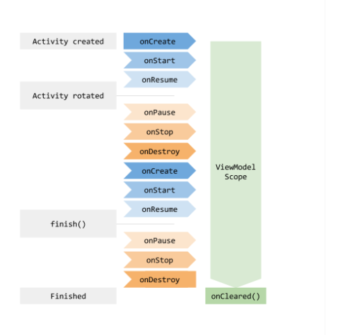

# ViewModel

> `ViewModel` 클래스는 수명주기를 고려해 UI 관련 데이터를 저장하고 관리하는 것을 담당하는 부분이다.
>
> `ViewModel`을 사용하면 화면 변경에 상관없이 데이터를 유지할 수 있다.
>
> `데이터`를 `로직`에서 소유권을 분리해 중앙에서 관리하고 필요한 놈한테 편하게 제공할 수 있다.  ~~이게 공산주의?!🤦‍♂️~~
>
> [공식문서를 활용합시다👩‍💻](https://developer.android.com/topic/libraries/architecture/viewmodel?hl=ko#kotlin )


- ViewModel.kt

```kotlin
class MyViewModel : ViewModel() {
    private val users: MutableLiveData<List<User>> by lazy {
        MutableLiveData().also {
            loadUsers()
        }
    }

    fun getUsers(): LiveData<List<User>> {
        return users
    }

    private fun loadUsers() {
        // Do an asynchronous operation to fetch users.
    }
}
```


- Activity.kt

```kotlin
class MyActivity : AppCompatActivity() {

    override fun onCreate(savedInstanceState: Bundle?) {
        // Create a ViewModel the first time the system calls an activity's onCreate() method.
        // Re-created activities receive the same MyViewModel instance created by the first activity.

        // Use the 'by viewModels()' Kotlin property delegate
        // from the activity-ktx artifact
        val model: MyViewModel by viewModels()
        model.getUsers().observe(this, Observer<List<User>>{ users ->
            // update UI
        })
    }
}
```


## ViewModel 생명주기




## LiveData

> `ViewModel`을 공부했는데 `LiveData` 공부를 안한다!?  ~~자네는 곱창먹을 때 소주도 안먹을 사람~~
>
> `LiveData`은 식별 가능한 데이터 홀더 클래스.
>
> 일반 식별 가능 클래스와 달리 `LiveData`는 수명 주기를 인삭할 수 있어서 다른 앱 구성요소의 수명주기를 고려한다. 이를 통해 활동 수명주기 상태에 있는(== 변경중인?) 앱 구성요소 관찰자만 업데이트 할 수 있습니다. ( 나머진 그대로 두고 변경된 것만 업데이트?!)


### Why LiveData?👼

1. UI와 데이터 상태의 일치 보장

   > 항상 관찰하고 있다가 데이터가 변경되면 `Observer`객체에 이를 알리고 UI를 업데이트 하게 된다. 관찰자가 알아서 업데이트 해줘서 짱편리

2. 메모리 누수 없음!

   > 관찰자는 `LifeCycle`객체에 결합되어 있고, 연결된 수명 주기가 끝나면 자동으로 삭제

3. 수명주기를 수동으로 처리할 필요 없음!

   > UI 구성요소는 관련 데이터를 관찰하기만 할뿐! 동작에 영향을 주지 않는다. `LiveData`는 관찰하는 동안 관련 수명 주기 상태의 변경을 인식하기 때문에 이 모든 것을 자동으로 관리할 수 있음.

4. 적절한 구성 변경

   > 화면 회전 등 구성이 변경되면서 `Activity`나 `fragment`가 재성성되면 최신 데이터를 즉시 로딩합니다.

5. 최신 데이터 유지

   > 수명주기가 재활성화 되면 최신 데이터를 로딩힙니다.


- LiveData 객채 생성

```kotlin
class NameViewModel : ViewModel() {

    // Create a LiveData with a String
    val currentName: MutableLiveData<String> by lazy {
        MutableLiveData<String>()
    }

    // Rest of the ViewModel...
}
```


- LivaData 객체 관찰

```kotlin
class NameActivity : AppCompatActivity() {

    // Use the 'by viewModels()' Kotlin property delegate
    // from the activity-ktx artifact
    private val model: NameViewModel by viewModels()

    override fun onCreate(savedInstanceState: Bundle?) {
        super.onCreate(savedInstanceState)

        // Other code to setup the activity...

        // Create the observer which updates the UI.
        val nameObserver = Observer<String> { newName ->
            // Update the UI, in this case, a TextView.
            nameTextView.text = newName
        }

        // Observe the LiveData, passing in this activity as the LifecycleOwner and the observer.
        model.currentName.observe(this, nameObserver)
    }
}
```


- LiveData 객체 업데이트

```kotlin
button.setOnClickListener {
    val anotherName = "John Doe"
    model.currentName.setValue(anotherName)
}
```

