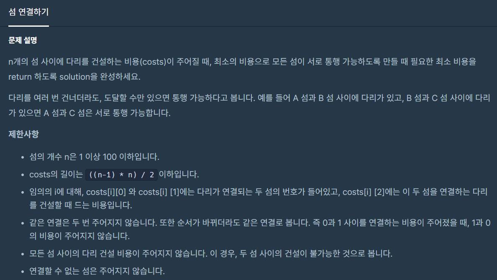
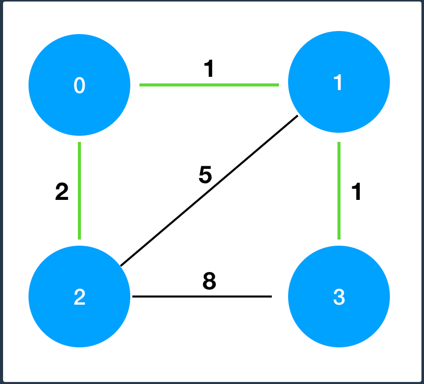

# Programmers _섬연결하기

> [`섬 연결하기`](https://programmers.co.kr/learn/courses/30/lessons/42861#) 문제는 `최소 비용 신장 트리(MST)`의 가장 대표적인 문제 유형 중 하나이다.
>
> 일반적으로 `크루스칼 알고리즘` 과 `프림 알고리즘`으로 해결하는데 이번에는 크루스칼 알고리즘을 통해 풀이해보았다.







---

## Kruskal 알고리즘이란?!

> `Greedy method` 를 이용한 방식으로, 네트워크의 모든 정점을 최소비용으로 연결하여 최적의 답을 구해내는 방식을 의미한다.
>
> 우선적으로 모든 간선을 비용의 오름차순으로 정렬시키고, 하나씩 연결해나가면서 모든 정점의 연결 상태를 확인해나가야한다.
>
> 하지만 이때 `사이클`의 형태가 포함되는 순간 최소비용이 아니게 되므로 사이클을 포함시키면 안된다.


### Union-by-rank

> 각자의 객체를 생성한 후(`make_set`), 각 정점이 연결됨에 따라서 그 정점의 소속을 확인 한 후(`find`)
>
> 1. 두 정점의 소속이 같다면: 앞서 말한 `사이클`이 형성되는 경우이므로 그냥 pass
> 2. 두 정점의 소속이 다르다면: 두 소속을 인수합병!(union)

- 그럼 Rank는 뭐시여?

  > 길이(크기가) 작은놈을 큰놈에 가져다 붙이는게 보다 합리적인 메커니즘
  >
  > -> 랭크를 기록해두어 더 짧은 쪽을 가져다 붙인다!


```python
#### Union by rank 기법!!
parent = {}
rank = {}
# 초기화, 각 정점을 독립된 집합으로 생성
def make_set(i):
    parent[i] = i
    rank[i] = 0

def find(i):
    # 초기화 상태와 같지 않다면! ( 다른곳에 소속됐다면)
    if parent[i] != i:
        # 부모님 찾아보기
        parent[i] = find(parent[i])
    return parent[i]

# 두 정점 연결쓰~
def union(i, j):
    root1 = find(i)
    root2 = find(j)
    if root1 != root2:
        # 더 짧은것을 연결하는 것이 좋다
        if rank[root1] > rank[root2]:
            parent[root2] = root1
        else:
            parent[root1] = root2

            if rank[root1] == rank[root2]:
                rank[root2] += 1


n = 4
costs = [[0, 1, 5], [1, 2, 3], [2, 3, 3], [1, 3, 2], [0, 3, 4]]
costs.sort(key=lambda x: x[2])

result = 0
for i in range(n):
    make_set(i)

for cost in costs:
    i, j, in_cost = cost

    if find(i) != find(j):
        union(i, j)
        result += in_cost
print(result)
```


- [MST 문제 묶음](https://www.acmicpc.net/step/15) 누가 친절하게 모아 두신것도 있으니까 복습하면서 하면 좋을듯!?