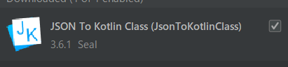

# Kakao Map API 활용하기!

> 현재 프로젝트에서 장소 검색을 필요로 하는 부분이 있어써 `Retrofit`과 `Kakao Dev`를 활용해 구현을 해보았습니다. 머나먼 여정이였지만, 아직 그 여정 속에 있지만, 추후 이 길을 따라 걸을 누군가를 위해 나뭇가지를 꺾어놓겠습니다.🦶
>
>
> 이 글은 [개발왕 금골드](https://kumgo1d.tistory.com/57)님의 티스토리에서 많은 배움을 통해 작성할 수 있었습니다. 감사합니다. 🙏🙏🙏🙏🙏🙏


❌ 이 글에선 `Retrofit`에 자세한 셋업은 다루지 않습니다. 

⭕ 저는 `안드로이드` 앱 기반 `Kotlin` 언어로 작성하였습니다.


## 1. 인터넷 권한 추가하기

- AndroidManifest.xml

```xml
    <uses-permission android:name="android.permission.INTERNET" />
    <uses-permission android:name="android.permission.ACCESS_FINE_LOCATION" />
```

> 권한을 추가해주십쇼!


## 2. Data class 생성하기

> API 통신의 응답으로 오는 `.JSON`형식에 맞게끔 데이터폼을 형성해주는 과정이다. 처음에는 한땀한땀 만들어서 수동으로 생성해주었는데, 이를 자동으로 해주는 옴팡진 `플러그인`이 있었다.


### 플러그인 설치하기

> 이참에 플러그인 설치하는 것도 알아두면 좋지 아니한가?
>
> `File` -> `Settings` -> `Plugin`  으로 들어가면 다양한 플러그 인을 설치할 수 있다.
>
> 여기서 우리에게 필요한 건? 
>
> `JSON To Kotlin Class` 라는 플러그 인이 있다. 응답으로 오는 JSON을 넣어주기만 해도 모든 데이터가 자동으로 생성된다.




## 3. 불러오기 위한 뚝딱뚝딱

- RetrofitBuilder.kt

```kotlin
// 전 이곳에 Api 통신에 필요한 Base_URL과 API_KEY을 작성해주었습니다. 다른곳에해도 지장.. 없을듯!?

class kakaoApi {
    companion object {
        const val Base_URL = "https://dapi.kakao.com/"
        const val API_KEY = "KakaoAK 프라이버시입니다.당신의 코드를 적어주세요"
    }
}


object KakaoRetrofitBuilder {
    // 이 클라이언트가 의미하는 건 확실하게 이해하진 못했습니다. 금골드님이였나? 그분은 다르게 작성했으니 참고해보세요!
    private val client = OkHttpClient.Builder().build()

    private val retrofit = Retrofit.Builder()
            .baseUrl(kakaoApi.Base_URL)
            .addConverterFactory(GsonConverterFactory.create())
            .client(client)
            .build()

    fun<T> buildService(service: Class<T>): T{
        return retrofit.create(service)
    }
}
```


- RetrofitService.kt

```kotlin
interface KakaoApiService {
    // 요청 방식과 주소를 작성해줍시다.
    @GET("/v2/local/search/keyword.json")
    
    // 헤더에는 권한을 위해 Authorization을 넣어주고 쿼리값으로 필요한 데이터를 넣어줍시다.
    fun placeSearch(
            @Header("Authorization") key: String,
            @Query("query") query: String,
            @Query("x")x: Double,
            @Query("y")y: Double,
            @Query("page")page: Int,
            @Query("size")size: Int,
    ) : Call<KeywordSearchResponse>
}
```

> 원래는 이렇게 허접하게 쿼리를 작성해선 안됩니다.🤦‍♂️ `HashMap`으로 묶어서 처리하고 싶었으나 자꾸 오류가 발생해서 급한대로 요렇게 처리했습니다.
>
> 여러분은 저보다 현명하실테니 이쁘게 구성하시고! 혹시 더 나은 방법이 있다면 알려주시면 감사히 배우겠습니다.


- MapsActivity.kt

```kotlin
// 저는 지도위에 띄울거라 MapActivity에서 작성했지만 여러분은 필요한 곳에 사용하세요!


    fun Search() {
        // 위에서 작성한 kakaoApiService를 불러와요
        var kakaoApiService: KakaoApiService = KakaoRetrofitBuilder.buildService(KakaoApiService::class.java)
        // placeSearch에 필요로하는 데이터를 넣고 호출을 합니다. 여기서 kakaoApi.API_KEY통해 키값을 넣어준다는 것만 기억하시면 될듯!?
        var call = kakaoApiService.placeSearch(kakaoApi.API_KEY, binding.inputPlaceName.text.toString(), x.toDouble(), y.toDouble(), 1, 5)
        // 여기 적혀있는 KeywordSearchResponse는 위에서 플러그인을 사용해 데이터 형태를 구성할 떄 `class`에 넣어준 값입니다.
        call.enqueue(object : Callback<KeywordSearchResponse> {
            override fun onResponse(call: Call<KeywordSearchResponse>, response: Response<KeywordSearchResponse>) {
                if (response.isSuccessful) {
                    Log.d("sendSearch", "오나?")
                    Log.d("sendSearch", "${response.body()}")
                }
            }

            override fun onFailure(call: Call<KeywordSearchResponse>, t: Throwable) {
                t
                TODO("Not yet implemented")
            }

        })
    }
```


#### 이론보단 코드 부분만 호다닥 작성해보았습니다. 용건만 간단히!🙋‍♂️


