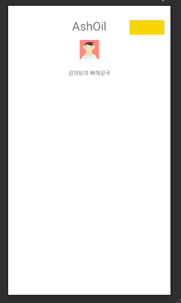
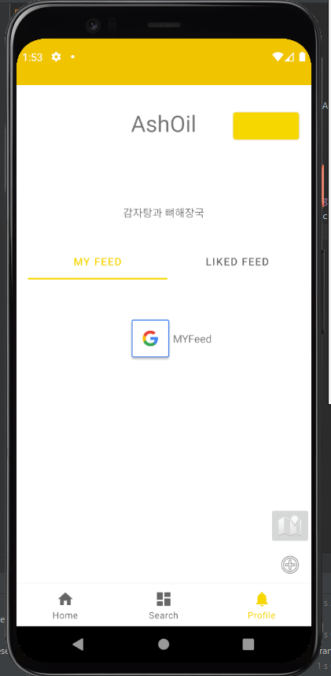

# Fragment 내부에 Tab바 추가로 구현하기!

> 이러한 방식으로 구현하는 게 틀릴 수도 있다는 생각이 든다! 하지만 MockUp 설계 상 Nav 내부에 또 하나의 Tab을 구현하는 형태가 생기게 되었다.
>
> 일단 구현을 해보자!
>
> 이걸 구현할 때, [Solution Code Android](https://www.youtube.com/channel/UCN65_YJP9E4kWCXnNeeRg2Q) 이 영상에서 많은 도움을 받았다. 조회수 300도 안되는 영상을 어떻게 찾아들어 갔는진 몰라도! 지구 반대편에 계실 개발자님 감사합니다.
>
> (위 영상에서 `Style`관련된 요소는 생략하고, ActionBar로 구현한 걸 tab으로 변경하였다.)


## 파일 구조 형태

- MainActivity
  - HomeFragment

  - SearchFragment

  - MyInfoFragment (여기서부터 구현할 예정)

    > 하나의 프레그먼트 안에

    - InnerTabFragment

      > 하나의 Tab이 더 들어있고, 그 안에 Fragment 2개가 존재하는 형태!

      - MyFeedFragment
      - LikeFeedFragment

  

 

## MyInfoFragment



```xml
<androidx.constraintlayout.widget.ConstraintLayout
    xmlns:android="http://schemas.android.com/apk/res/android"
    xmlns:app="http://schemas.android.com/apk/res-auto"
    xmlns:tools="http://schemas.android.com/tools"

    tools:context=".ui.myinfo.MyInfoFragment"
    android:id="@+id/container"
    android:layout_width="match_parent"
    android:layout_height="match_parent">

...
    <fragment
        android:id="@+id/fragment_inner_tab"
        android:name="com.omnyom.yumyum.ui.myinfo.InnerTabFragment"
        android:layout_width="0dp"
        android:layout_height="0dp"
        android:layout_marginTop="16dp"
        app:layout_constraintBottom_toBottomOf="parent"
        app:layout_constraintEnd_toEndOf="parent"
        app:layout_constraintHorizontal_bias="0.495"
        app:layout_constraintStart_toStartOf="parent"
        app:layout_constraintTop_toBottomOf="@+id/tv_introduction"
        tools:layout="@layout/fragment_inner_tab" />

...
</androidx.constraintlayout.widget.ConstraintLayout>
```


- 하단에 다음과 같이 `fragment`가 들어갈 영역을 설정해줍니다.
- 여기서 layout을 `tools:layout="@layout/fragment_inner_tab"` 로 설정해 innertab이 포함되도록 해주세용


## InnerTabFragment

```kotlin

class InnerTabFragment : Fragment() {
	
    // layout과 binding 해준다.
    val binding by lazy { FragmentInnerTabBinding.inflate(layoutInflater) }
    
    // 여기는 사용할 tab, viewPager, pagerAdapter을 선언해준다
    lateinit var tabs: TabLayout
    lateinit var viewPager: ViewPager
    lateinit var pagerAdapters: PagerAdapters

    override fun onCreateView(
        inflater: LayoutInflater,
        container: ViewGroup?,
        savedInstanceState: Bundle?
    ): View? {
		
        // 위에서 선언한 3개 요소를 내부 layout 요소와 연결해준다.
        tabs = binding.tabs
        viewPager = binding.viewPager
        // 이때 fragment안에서 fragment를 관리하려면 childFragmentManager을 사용!!!!
        pagerAdapters = PagerAdapters(childFragmentManager)
		
        // 내부 요소를 넣어줍니다!
        pagerAdapters.addFragment(MyFeedFragment(), "MY Feed")
        pagerAdapters.addFragment(LikeFeedFragment(), "Liked Feed")
        
        // 어탭터도 연결
        viewPager.adapter = pagerAdapters

        tabs.setupWithViewPager(viewPager)

        return binding.root
    }

}
```


## PagerAdapter

```kotlin

class PagerAdapters(sFM: FragmentManager): FragmentPagerAdapter(sFM, BEHAVIOR_RESUME_ONLY_CURRENT_FRAGMENT) {

    private val pFragmentList = ArrayList<Fragment>()
    private val pFragmentTitle = ArrayList<String>()

    override fun getCount(): Int = pFragmentList.size
    override fun getItem(position: Int): Fragment = pFragmentList[position]
    override fun getPageTitle(position: Int): CharSequence = pFragmentTitle[position]

    fun addFragment(fm: Fragment, title: String) {
        pFragmentList.add(fm)
        pFragmentTitle.add(title)
    }
}
```


- 아직 Adapter에서 `BEHAVIOR_RESUME_ONLY_CURRENT_FRAGMENT` 부분은 아직 이해하지 못해서 더 공부해서 업데이트 하도록 하겠습니당😫

- 이 외에 내부 컴포넌트는 알아서 꾸미시면 됩니다!!


