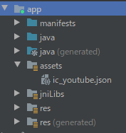

# Animated ICON!

> 개발을 위한 Icon 선정 회의 중, 애니메이션으로 동작하는 아이콘이 있어서 너무 탐났다. 구현할 수 있을진 모르겠지만, 일단 다운 받아놓고 구글링을 통해 답을 찾아보자
>
> 그 때, `lottie`라는 라이브러리를 발견했다. icon을 제공해주는 사이트에서도 `lottie`를 활용하라고 권장하고, 해당 형태의 파일(`JSON`)을 제공해준다.
>
> [lottie 공식 문서](http://airbnb.io/lottie/#/android?id=animation-listeners)


## gradle에 dependency 추가!

```
dependencies {
    ...
    implementation "com.airbnb.android:lottie:$lottieVersion"
    ...
}
```

> 여기에서 `$lottieVersion`에 가장 최신 버전인 `3.7.0`을 적어주었다.


## .xml 파일에 LottieAnimationView 추가!

```xml
<com.airbnb.lottie.LottieAnimationView
        android:id="@+id/animation_view"
        android:layout_width="wrap_content"
        android:layout_height="wrap_content"
        app:lottie_fileName="파일이름"
        // app:lottie_fileName="ic_youtube.json"
                                      
		/>
```

- 이 때, 사용할 JSON파일의 위치는 `assets`라는 폴더를 만들어서 넣어준다. 위치는 다음과 같다.




## 내 입맛대로 작동시키기

> 일반적으로 animated icon은 변했다가 원래 위치까지 돌아오는 `1cycle`을 갖고 움직인다. 하지만 내가 원하는 건, 클릭 시`A -> B`형태로 변하고 다시 클릭하면 ` B-> A`로 돌아오는 형태로 나타내고 싶었다.
>
> 그래서 이것저것 만져보면서 쫌 억지스럽게 구현을 해내긴했지만... 이게 맞는 방법이 아닐테니까 더 쉽고 정직한 방법 있으면 부탁드립니다.🙄🙄🙄


- 우선 내가 작성한 코드부터 살펴보자!

```kotlin
class MainActivity : AppCompatActivity() {
    private lateinit var binding : ActivityMainBinding

    override fun onCreate(savedInstanceState: Bundle?) {        

		............생략!
        
        // 여기에 animationView, animationView2 2개의 animationView가 존재하는 데 
        // 같은 자리에 겹쳐놓고 1이 끝에 도착하면 1을 숨기고 2가 나타나도록 구현한 것이다!
        
        // 이 부분은 여러 프레임으로 나눠진 animated icon의 시작점과 끝 점을 설정할 수 있다.
        // 15라는 수치는 이것저것 넣어보다가 내 icon에 원하는 부분이라 적어 넣은것 !
		binding.animationView.setMaxFrame(15)
        binding.animationView2.setMinFrame(15)
        
        // 애니매이션이 작동중일때 다시 클릭하게 되면 멈칫멈칫하는 모습이 나타나 그것을 막아준거!
        if (!binding.animationView.isAnimating && !binding.animationView2.isAnimating) {
            binding.animationView.setOnClickListener { icon1Click() }
            binding.animationView2.setOnClickListener { icon2Click() }
        }
    }

    
    fun icon1Click() {
        // 클릭시 애니메이션 작동
        binding.animationView.playAnimation()
        // 800은 ms단위, 0.8초 후, 해당 내용을 실행하겠다~~ 이런느낌 (setTimeOut 같은거!)
        Handler().postDelayed({
            // 지금 돌고 있는 animationView는 숨기고, animationView2를 띄워준다.
            // animationView의 끝점 == animationView2의 시작점 ㅇㅋ?
            binding.animationView.visibility = View.INVISIBLE
            binding.animationView2.visibility = View.VISIBLE
            // 그리고 animationView의 모습을 처음상태로 돌린다.
            binding.animationView.progress = 0.0f

        }, 800)
    }

    fun icon2Click() {
        binding.animationView2.playAnimation()
        Handler().postDelayed({
            binding.animationView2.visibility = View.INVISIBLE
            binding.animationView.visibility = View.VISIBLE
            binding.animationView2.progress = 0.5f
        }, 800)
    }
```


- 내가 작성한 코드지만 해당 기능을 자체적으로 제공하지 않을거같진 않다... 공식문서 열심히 살펴봤지만 도저히 찾을 수 없긴 했는데,,, 이걸 안만들어놨을까.. 설마... 있겠지..? 있을거야...
- 일단 급한대로 필요하신 분, 사용하시고 더 좋은 방법 깨달으면 업데이트 하겠습니다.😤😤