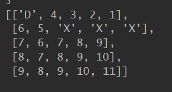

# BOJ_3055_탈출!

> 요즘 마음을 다잡은 김에 다시 알고리즘 스터디에 참여해 문제를 풀기로 결심했다. 
>
> 나는 개발자가 될 수 있다. 
>
> ~~쏠쑤이쏘!!~~


## 1트! -> DFS

```python
import sys; sys.stdin = open('input_data/3055.txt')
# 복사해서 DFS에 같이 담아주려고 deepcopy를 사용했다!
# 2중 이상의 list 형태라면 꼭!! deepcopy를 해줘야 한다이?! 
from copy import deepcopy

# 벡터로 상하좌우값을 넣어놓고 나중에 사용한다.
dx = [1, -1, 0, 0]
dy = [0, 0, 1, -1]

# 맨 처음엔 DFS로 풀어보았다.
# 함수 정의보다 아래부터 읽는게 이해하기 쉬워요!
def DFS(x, y, depth, Ground, visit, water_list):
    global Max
    # 왜 맨처음엔 이렇게 생각했는진 몰라도 DFS에 지도와 방문처리를 같이 담아서 보냈다.
    now_ground = deepcopy(Ground)
    now_visit = deepcopy(visit)
    # water_list랑 now_water를 동시에 쓴 이유는 아래에서 while로 돌리기 때문에 계속 들어가면 안되기 때문에! 저번껏만 처리하고 이번껀 따로 담아서 다음 스테이지에서 처리해!
    now_water = []
    if depth >= Max:
        return
    now_visit[x][y] = 1
    while water_list:
        # 하나씩 빼서
        water_x, water_y = water_list.pop()
        # 네 방향 확인
        for k in range(4):
            tx = water_x + dx[k]
            ty = water_y + dy[k]
            # 적합하면?
            if 0 <= tx < height and 0 <= ty < width and [tx, ty] not in water_list and (Ground[tx][ty] == "." or Ground[tx][ty] == "S"):
                # now_water에 담아서 다음에 물 잠길 곳 체크
                now_ground[tx][ty] = "*"
                now_water.append([tx, ty])
	# 또 네방향 확인해서
    for i in range(4):
        tx = x + dx[i]
        ty = y + dy[i]
        if 0 <= tx < height and 0 <= ty < width and now_ground[tx][ty] == "D":
            if Max > depth + 1:
                Max = depth + 1
                return
        # 적합하면
        if 0 <= tx < height and 0 <= ty < width and now_ground[tx][ty] == "." and not visit[tx][ty]:
            # ㄱㄱㄹ~
            DFS(tx, ty, depth+1, now_ground, now_visit, now_water)

# 여기부터 읽으세요!?
# 값 불러오기
height, width = map(int, sys.stdin.readline().split())
Ground = []
hole = list()
quokka = list()
water_list = []
# 한 줄씩 불러오면서
for i in range(height):
    # sys.stdin.readline() -> 일반적인 input()보다 훨씬 빨라서 시간초과시 꿀팁
    line = list(' '.join(sys.stdin.readline()).split())
    Ground.append(line)
    # 각 라인에 해당 요소가 있으면 값 지정해줌
    if not hole:
        if "D" in line:
            hole = [i, line.index("D")]
    if not quokka:
        if "S" in line:
            quokka = [i, line.index("S")]
    if line.count("*") > 1:
        for j in range(line):
            water_list.append([i,j])
    elif line.count("*") == 1:
        water_list.append([i,line.index("*")])
# 방문처리할 visit 생성
visit = [[0]*width for _ in range(height)]
# origin은 원래 값하고 똑같으면 경로가 없는 것으로 "KAKTUS" 출력할라꼬!
origin = width * (height//2 + 1)
Max = origin
DFS(quokka[0], quokka[1], 0, Ground, visit, water_list)
if Max == origin:
    print("KAKTUS")
else:
    print(Max)
```


- 시간 초과`로 틀렸다. 근데 딱봐도 시간 초과가 안날수가 없는 구조다. 저렇게 재귀형태인데 데이터도 왕빵많고 영 안좋다~! 😥😥😥😥


## 2트!!! -> BFS

> 아무렴 이런 문제는 `시간`이나 `메모리`나 BFS가 훨씬 적합한 문제다.
>
> 당연한건데 이런거 감을 잃을 정도면 반성해야겠다. 

```python
import sys; sys.stdin = open('input_data/3055.txt')
from copy import deepcopy
from collections import deque

dx = [1, -1, 0, 0]
dy = [0, 0, 1, -1]

height, width = map(int, sys.stdin.readline().split())
Ground = []
hole = list()
quokka = list()
water_list = deque()
for i in range(height):
    line = list(' '.join(sys.stdin.readline()).split())
    Ground.append(line)
    if not hole:
        if "D" in line:
            hole = [i, line.index("D")]
    if not quokka:
        if "S" in line:
            quokka = [i, line.index("S")]
    if line.count("*") > 1:
        for j in range(len(line)):
            if line[j] == "*":
                water_list.append([i,j])
    elif line.count("*") == 1:
        water_list.append([i,line.index("*")])

visit = [[0]*width for _ in range(height)]
origin = width * (height//2 + 1)
Max = origin
# 그냥 list를 사용하는 것보다 deque를 사용해서 앞뒤로 빼주는게 훨씬 더 효율적이다.
Q = deque()
Q.append([quokka[0], quokka[1], 0, Ground, visit, water_list])

# --------------- 여기까진 아까랑 같은 느낌으로 작성했습니다. -------------------
while Q:
    x, y, depth, my_ground, my_visit, my_water_list = Q.popleft()
    now_ground = deepcopy(my_ground)
    now_visit = deepcopy(my_visit)
    now_water = []
    now_visit[x][y] = 1
    while my_water_list:
        water_x, water_y = my_water_list.pop()
        for k in range(4):
            tx = water_x + dx[k]
            ty = water_y + dy[k]
            if 0 <= tx < height and 0 <= ty < width and [tx, ty] not in now_water and (
                    my_ground[tx][ty] == "." or my_ground[tx][ty] == "S"):
                now_ground[tx][ty] = "*"
                now_water.append([tx, ty])

    for i in range(4):
        tx = x + dx[i]
        ty = y + dy[i]
        if 0 <= tx < height and 0 <= ty < width and now_ground[tx][ty] == "D":
            if Max > depth + 1:
                Max = depth + 1
                pass
        if 0 <= tx < height and 0 <= ty < width and now_ground[tx][ty] == "." and not now_visit[tx][ty]:
            go_water = deepcopy(now_water)
            Q.append([tx, ty, depth + 1, now_ground, now_visit, go_water])

if Max == origin:
    print("KAKTUS")
else:
    print(Max)
```


- 이번에는 `데이터초과`가 났던 걸로 기억한다.
- 여기에서도 deepcopy를 통해서 너무 무거운 데이터를 계속 복사하고 저장하고 퍼 나르니 제대로 작동할 리가 없다.
- 모든 코드를 삭제하고, 맥주 한잔하고 새로운 마음으로 코드를 작성했다.


## 3트!!!!!!!!!! -> 역시 BFS, 

```python
import sys; sys.stdin = open('input_data/3055.txt')
from collections import deque

dx = [1, -1, 0, 0]
dy = [0, 0, 1, -1]

height, width = map(int, sys.stdin.readline().split())
Ground = [list(' '.join(sys.stdin.readline()).split()) for _ in range(height)]
water_list = deque()
result = "KAKTUS"
# 방문처리 형태부터 바뀌었다. 각 위치를 갈 수 있는 최단 거리를 작성하도록 수정했고, 그러기 위해 충분히 큰 값을 처음부터 넣어주었다.
visit = [[100]*width for _ in range(height)]
Q = deque()

# 그리고 각 단계에서 물의 이동정도를 표시하는 것이 아니고, 처음부터 지도에 각 단계별 물이 어디까지 차는지 모두 표시해두었다. 상황은 아래에 이미지도 넣어놓을게유
for i in range(height):
    for j in range(width):
        if Ground[i][j] == "*":
            Ground[i][j] = 1
            water_list.append([i, j, 1])
        elif Ground[i][j] == "S":
            Q.append([i, j, 1])
        elif Ground[i][j] == "D":
            hole = [i, j]

while water_list:
    x, y, depth = water_list.popleft()
    for i in range(4):
        tx = x + dx[i]
        ty = y + dy[i]
        if 0 <= tx < height and 0 <= ty < width and (Ground[tx][ty] == "." or Ground[tx][ty] == "S"):
            Ground[tx][ty] = depth + 1
            water_list.append([tx, ty, depth + 1])
            
            
# 이젠 고슴도치 이동            
while Q:
    x, y, depth = Q.popleft()
    visit[x][y] = depth
    depth += 1
    # 네 방향 살펴보고
    for i in range(4):
        tx = x + dx[i]
        ty = y + dy[i]
        # 도착지에 왔을 때, 최단거리면 기록하기.
        if [tx, ty] == hole:
            if type(result) == int and depth -1 < result:
                result = depth - 1
            else:
                result = depth - 1   
        # 만일 지도가 숫자로 표시되어 있으면(type(Ground[tx][ty]) == int) 물이 올 것이고, 
        # 물이 오는 타이밍이 현재 내 depth보다 크면(아직 물이 안왔으면 : Ground[tx][ty] > depth) BFS에 추가
        if 0 <= tx < height and 0 <= ty < width and type(Ground[tx][ty]) == int and visit[tx][ty] > depth and Ground[tx][ty] > depth:
            visit[tx][ty] = depth
            Q.append([tx, ty, depth])
        # 아까 숫자로 다 표시해놓았는데, 아무리 오래 지나도 물이 애초에 물이 안닿는 영역은 "."로 남아있기 때문에 이부분 처리해주었다.
        elif 0 <= tx < height and 0 <= ty < width and Ground[tx][ty] == "." and visit[tx][ty] > depth:
            visit[tx][ty] = depth
            Q.append([tx, ty, depth])

print(result)
```




- Ground를 보면 이런식으로 숫자로 물이 침범하는데 얼마나 걸리는지 표시했다.
- 이번에 네이버 코테를 보면서 효율성검사가 중요하다는걸 다시 한 번 느꼈고, boj문제를 통해 최대한 효율적으로 코드를 구성하는 법을 꾸준히 공부해야겠다!