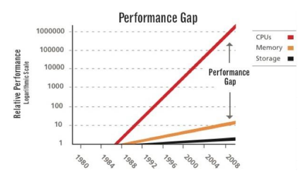
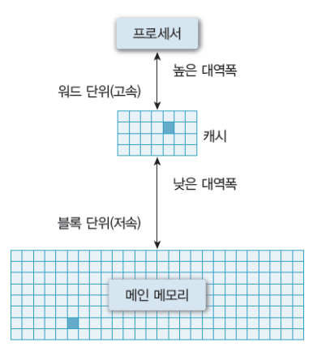

# [0721] Day 3

## 일반적인 캐시 동작과 캐시 동작을 결정하는 캐시 교체 정책에 대해 학습하고 정리한다.

### 캐시란?

- 프로세서 내부에 있는 메모리(L1, L2 캐시 등)
- 속도는 빠르지만, 가격이 비싸다
- **메인메모리의 입출력 병목현상 해소**

- 캐시의 동작
  - 일반적으로 Hardware적으로 관리됨
  - 캐시 히트(Cache hit)
    - 캐시 내부에 필요한 데이터 블록이 존재
  - 캐시 미스(Cache miss)
    - 필요한 데이터 블록이 없는 경우

#### 캐시히트면 다행인데 없으면 더 많은 경로를 거쳐야 하는데? 오히려 손해 아님!? 그 쪼만한 캐시 용량에 얼마나 저장된다고?!?!

**지역성**으로 해결됨!!

- **캐시의 지역성(Locality)**
  - 공간적 지역성 (Spatial locality)
    - 참조한 주소와 인접한 주소를 참조하는 특성
    - 일반적으로 참조한 거 근처꺼 작동한다~
    - ex) 순차적 프로그램 수행
  - 시간적 지역성 (Temporal locality)
    - 한 번 참조한 주소는 곧 다시 참조하는 특성
    - 일반적으로 썼던 거 또 쓴다~
    - ex) For문 등 순환문

--> `지역성`은 **`캐시 적중률(Cache hit ratio)`**과 밀접, 알고리즘 성능 형상을 위한 중요 요소!

### 캐시 교체 알고리즘 종류

| method  | 방식                        | 특징                                       |
| ------- | --------------------------- | ------------------------------------------ |
| Random  | 임의 선정                   | 오버헤드가 적음                            |
| FIFO    | 선입선출                    | 자주 사용되는 페이지도 교체될 수 있음      |
| LFU     | 사용횟수가 가장 적은거 교체 | 최근 적제된 페이지가 교체될 수 있음        |
| MFU     | 사용횟수가 가장 많은거 교체 | 많이 썼으니 앞으로 안쓸거다... 라는 마인드 |
| LRU     | 가장 오래전 사용된 거 교체  | time stamping에 의한 오버헤드 존재         |
| Optimal | 안쓸거 같은거 교체          | 현실성 없음                                |

## LRU(Last-Recent-Used) 캐시 동작 방식에 대해 학습하고 본인이 설계한 방식을 정리한다.

### LRU 교체 알고리즘

- 가장 오랫동안 사용하지 않았다면, 앞으로도 별로 쓸일이 없지 않을까? 에서 시작된 알고리즘
- 알고리즘 구현 방법
  - 페이지에 저정된 데이터가 언제사용되었는지 기록하여, 가장 오래된 자료를 제거
  - 데이터를 큐 형태로 저장하고, 재사용된건 제거했다가 맨 위로 다시 올리고, 삭제가 필요하다면 가장 아래 있는 것을 제거

### 내가 설계한 방식

- LRU 알고리즘에 대해 잘 알지도 못했고, 급하게 구현했다. 내가 구현한 방식은 뭔가 가장 오래된 데이터를 기억하는 것과 큐 형태가 합쳐진 형태로 구현한 것 같다.
- 현태 캐시에 저장된 것을 들어온 순서대로 저장해두고, 그 중 또 다시 호출된 것이 있으면 제거 했다가 다시 저장하는 형태로 구현하였다.

## HashMap (또는 Dictionary)와 LRU 캐시 차이점에 대해 학습하고 정리한다.

- 이 두개사이의 차이점이란게 있나????????? LRU 캐시는 자료구조가 아닌게 아닌가?!!!?!!

## 콘솔 프로그램에서 입/출력을 처리하기 위한 방식에 대해 학습하고 정리한다.

- kotlin에서 표준 출력방식(STDOUT)으로 `println()`을 사용하고 있다.
  - line을 전체 차지하고 싶지 않으면 간단히 `print()`로 구현해도 상관없다.
- 또한 표준 오류 출력방식(STDERR)로는 `System.err.println()` 이런 식으로 출력하면 된다.

- Commandline에서 간단히 입력을 받을 땐 `readLine()`을 사용하면되고, 보다 복잡한 구현에는 `java.util.Scanner`가 사용되기도 한다.

## 각자 선택한 크롤링 도구에 대해 선택 기준과 동작 방식에 비교한다.

- `jSoup`을 사용했으며, 선정 기준은 참고할 자료가 많다는 점에서 사용했습니다.....
  - HTML 문서를 읽어들인 후 DOM 객체로 변환시켜준다
  - 이후 `Selector`를 사용해 특정 element로 접근하고 해당 요소의 정보를 읽거나 수정할 수 있다.
  - 웹페이지까지 읽어들이는 기능까지 진행하는 라이브러리는 아니다

###### 참고자료

https://m.blog.naver.com/PostView.naver?isHttpsRedirect=true&blogId=babyj2005&logNo=221508257824

https://alvinalexander.com/kotlin/io-in-kotlin-reading-writing-files-command-line-console/

http://www.dreamy.pe.kr/zbxe/CodeClip/163977