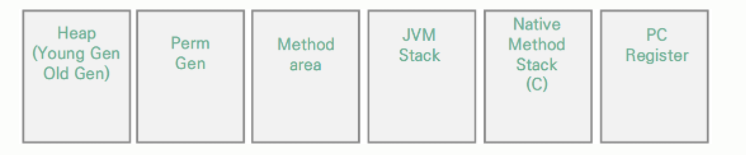
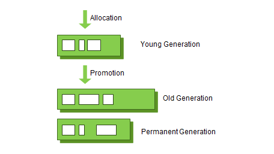
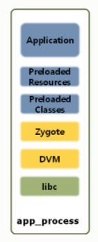

# [0722] Day 4

## 일반적인 프로세스 메모리 모델에 대해 학습하고 정리한다.

### JVM이란

- Java Virtual Machine의 약자
- 운영체제의 메모리 영역에 접근하여 메모리를 관리하는 프로그램
- 메모리 관리, GC 수행 등

### JVM의 일반적인 메모리 구조

### Heap

- 프로그램을 생성 시 구성됨
- JVM 설정에 따라 크기가 결정됨
- 일반적으로 객체들이 할당되어 사용하며, 참조가 없으면 GC에 의해 제거됨
- Young Generation
  - `Eden`과 `Survivor`로 메모리 공간 분류
    - Eden에 객체들이 채워지면, GC에서 살아남은 객체들을 Survivor로 이동
    - Survivor공간을 옮겨다니면서 오래 살아남으면 Old Gen.으로 이동

### Perm Gen.

- 애플리케이션의 메타 데이터 저장
- 사용되고 있는 애플리케이션의 클래스나 메서드 정보로 구성

### Method area

- Perm Gen.의 일부로 주로 클래스, 메서드 데이터, 생성자, 필드데이터로 구성
- 클래스별로 `Runtime constant pool`이라는 공간 실행시 생성

### Memory pool

- 불변값을 저장하는 공간으로 사용됨
- Perm에 구성되기도 하지만 heap에 구성되는 경우도 존재
- Heap에 있으면 GC에 의해 제거될 수도 있다.

### JVM Stack

- 스택은 생성되는 스레드마다 개별적으로 생성
- 매서드의 결과, 반환값을 저장하거나 임수변수인 지역 변수 등을 담아두는 데 사용

### Native Method Stack

- C스택이라고도 하며, 자바에 의해 사용되지 않고 JVM 외부의 요소를 사용할 때 이용

### PC(Program Counter) Register

- JVM에서 사용하는 다음 명령(Instruction)을 처리하기 위해 사용

## JVM에서 가비지 콜랙터(Garbage Collector)에 대해 학습한다.

### `Garbage Collector`란?

> 사용자 코드에 의해 명시적으로 생성된 클래스 인스턴스를 자동으로 제거해 주는 로직

- `weak Generational hypothesis` : GC을 구현하기 위한 2가지 가정 사항

  - 대부분의 객체는 금방 접근 불가능 상태(Unreachable)가 된다.
  - 오래된 객체에서 젊은 객체로의 참조는 거의 발생하지 않는다.

- `stop-the-world` 

  - GC를 실행하기 위해 JVM의 모든 애플리케이션 실행을 중단하는것
  - GC를 실행하는 쓰레드를 제외한 모든 쓰레드가 중지된다.

  - `GC 튜닝 `
    -  stop-the-world 시간을 줄이는 것

- 물리적 공간의 분류
  - `weak Generational hypothesis` 의 장점을 최대한 활용하기 위해서 도입한 개념
  - `Young 영역` 
    - 새롭게 생성된 객체들이 위치
    - 대부분 금방 사라지며(금방 접근 불가능 상태가 되기 때문에) 객체가 사라질때 `Minor GC`가 발생한다고 한다.
  - `Old 영역`
    - 접근 불가능 상태로 되지 않고 `Young`에서 살아남은 객체들이 모이는 곳
    - Young 보다는 크게 할당되고, 상대적으로 GC는 적게 발생한다.
    - 이 영역에서 객체가 사라질 때, `Major GC (Full GC)`가 발생한다고 표현
  - `Permanent Generation 영역`
    - Method Area라고도 부른다.
    - 객체나 억류(intern)된 문자열 정보를 저장하는 곳
    - Old에서 살아남은 객체가 영원히 남아있는 곳이 아님!!
    - 이 영역에서 객체가 사라질 때도, `Major GC (Full GC)`가 발생한다고 표현

 	

## 안드로이드에서 사용하는 JVM 가상 메모리 관리 동작 방식에 대해 학습하고, 일반적인 메모리 모델과 차이점을 비교한다.

### 안드로이드 프로세스 구조

- 안드로이드는 DVM(Dalvik Virtual Machine)과 ART(Android Run Time)을 설계하면서 JVM과 일부 차별성을 갖기 시작하였습니다.

- 안드로이드 앱이 사용하는 `Heap`은 DVM 내에 존재하고, JVM과 유사하게 구조화 되어있으며 GC가 관리한다.

- 페이징과 메모리 매핑을 통해 메모리를 관리한다.
  - 앱이 수정하는 모든 메모리는 RAM에 계속 유지되고, 이는 GC에 의해서만 제거 될 수 있다.
  - 예외로, 시스템이 메모리를 다른 곳에 사용해야 할 경우, 메모리 매핑된 모든 파일이 RAM에서 페이지 아웃될 수 있다.

###### 참고자료

https://d2.naver.com/helloworld/1329

https://developer.android.com/topic/performance/memory-overview?hl=ko

https://acaroom.net/ko/blog/youngdeok/java-memory%EC%99%80-android%EC%9D%98-%EA%B0%84%EB%9E%B5%ED%95%9C-%EC%9A%94%EC%95%BD

https://charlezz.medium.com/jvm-dvm-art-%EC%9D%B4%ED%95%B4%ED%95%98%EA%B8%B0-c51d10dc56e3

https://mangkyu.tistory.com/118