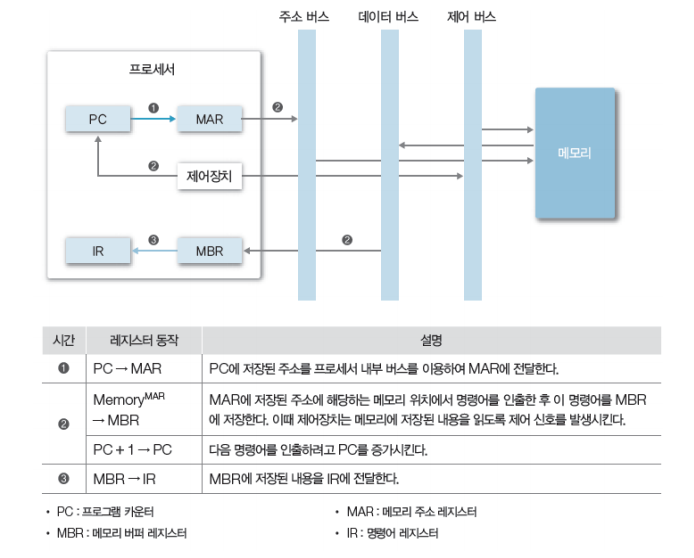

# [OS] Lecture 1. Computer System Overview

## 1. 컴퓨터 하드웨어

- 프로세서(Processor)
  - CPU
  - 그래픽카드(GPU)
  - 응용 전용 처리장치 등
- 메모리(Memory)
  - 주 기억장치
  - 보조 기억장치 등
- 주변장치
  - 키보드/ 마우스
  - 네트워크 모뎀 등

### 프로세서(Processor)

> 컴퓨터의 두뇌로 `연산`이나 장치의 `동작제어` 등을 담당하는 중앙처리 장치이다.

#### 레지스터(Register)

	- 프로세서 `내부`에 있는 메모리로 **프로세서가 사용할 데이터를 저장**해둔다. 컴퓨터에서 가장 빠른 메모리

- 종류
  - 용도 : 전용레지스터, 범용레지스터
  - 정보변경 가능여부 : 가시/불가시 레지스터
  - 정보의 종류 : 데이터 레지스터, 주소 레지스터, 상태 레지스터

### 운영체제와 프로세서

- 운영체제가 하는 역할 중 하나가 프로세서를 관리하는 것!
  - 프로세서에게 처리할 작업 `할당` 및 `관리`
  - 프로그램의 `프로세서 사용제어` : 프로그램 간 사용시간 관리 및 조율

## 메모리(Memory)

> 데이터를 `저장`하고 `관리`하는 장치 (기억장치)

- 메모리의 종류

  

### 1. 주 기억장치(Main memory)

- 프로세서가 수행할 프로그램과 데이터 저장
- DRAM을 주로 사용(용량, 저렴)
- **디스크 입출력 `병목현상`(I/O bottleneck) 해소**
  - main memory가 중간에서 중계자 역할

### 2. 캐시 (Cache)

- 프로세서 내부에 있는 메모리(L1, L2 캐시 등)
- 속도는 빠르지만, 가격이 비싸다
- **메인메모리의 입출력 병목현상 해소**

- 캐시의 동작
  - 일반적으로 Hardware적으로 관리됨
  - 캐시 히트(Cache hit)
    - 캐시 내부에 필요한 데이터 블록이 존재
  - 캐시 미스(Cache miss)
    - 필요한 데이터 블록이 없는 경우

#### 캐시히트면 다행인데 없으면 더 많은 경로를 거쳐야 하는데? 오히려 손해 아님!? 그 쪼만한 캐시 용량에 얼마나 저장된다고?!?!

**지역성**으로 해결됨!!

- **캐시의 지역성(Locality)**
  - 공간적 지역성 (Spatial locality)
    - 참조한 주소와 인접한 주소를 참조하는 특성
    - 일반적으로 참조한 거 근처꺼 작동한다~
    - ex) 순차적 프로그램 수행
  - 시간적 지역성 (Temporal locality)
    - 한 번 참조한 주소는 곧 다시 참조하는 특성
    - 일반적으로 썼던 거 또 쓴다~
    - ex) For문 등 순환문

--> `지역성`은 **`캐시 적중률(Cache hit ratio)`**과 밀접, 알고리즘 성능 형상을 위한 중요 요소!

​	

### 3. 보조 기억 장치 (Auxiliary memory, secondary memory, storage)

- 프로그램과 데이터를 저장
- 프로세서가 직접 접근할 수 없음(주변장치)
  - 주 기억장치를 거쳐서 접근
  - if 프로그램/데이터 크기 > 주 기억장치 크기 : `가상메모리(Virtual memory) ` 사용
    - 보조 기억장치 일부를 주기억장치처럼 사용
- 용량이 크고, 가격이 저렴

### 메모리와 운영체제

- 메모리 할당 및 관리
  - 프로그램에 요청에 따른 메모리 할당 및 회수
  - 할당된 메모리 관리
- 가상 메모리 관리
  - 가상 메모리 생성 및 관리
  - 논리주소 -> 물리주소 변환

## 주변 장치

> 프로세서와 메모리를 제외한 하드웨어들

- 입력 / 출력 / 저장 장치로 분류

### 주변장치와 운영체제

- 장치 드라이버 관리
  - 주변 장치 사용을 위한 인터페이스 제공
- 인터럽트(Interrupt) 처리
  - 주변 장치의 요청처리

- 파일 및 디스크 관리
  - 파일 생성 및 삭제
  - 디스크 공간 관리 등

## 2. 시스템 버스(System Bus)

> 하드웨어들이 데이터 및 신호를 주고 받는 물리적인 통로

###### *이  [강의](https://www.youtube.com/watch?v=EdTtGv9w2sA&list=PLBrGAFAIyf5rby7QylRc6JxU5lzQ9c4tN&index=1)를 통해 공부하고 배운 내용을 정리하였습니다.