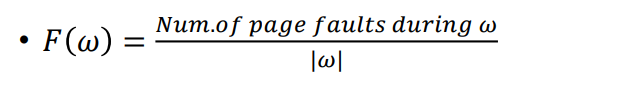
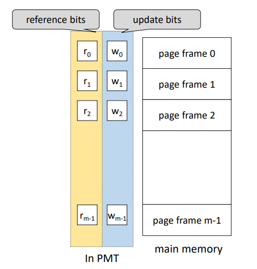
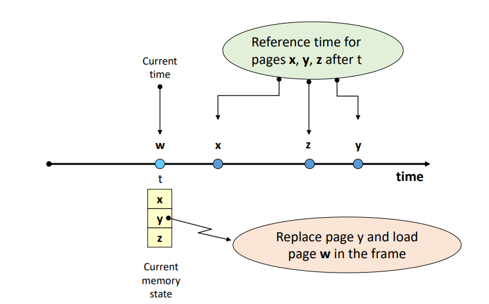
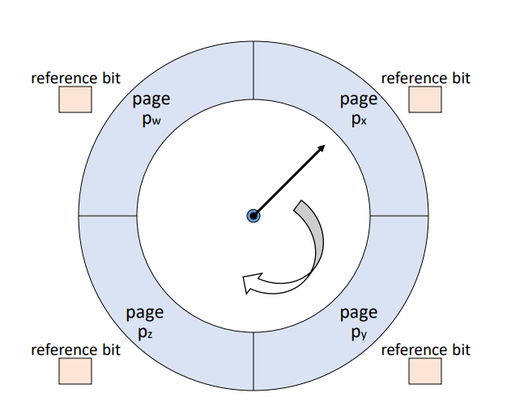
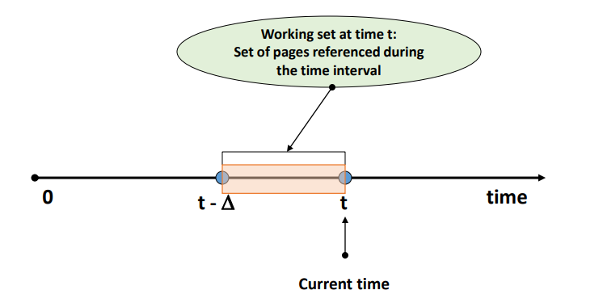
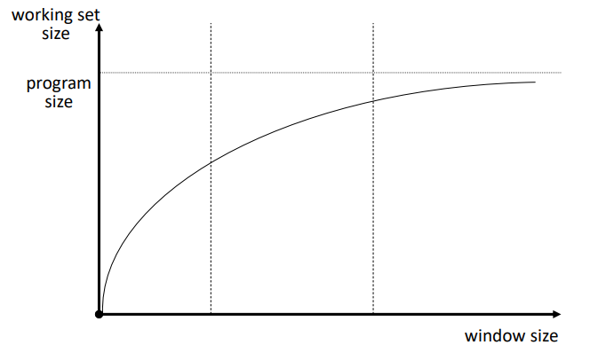
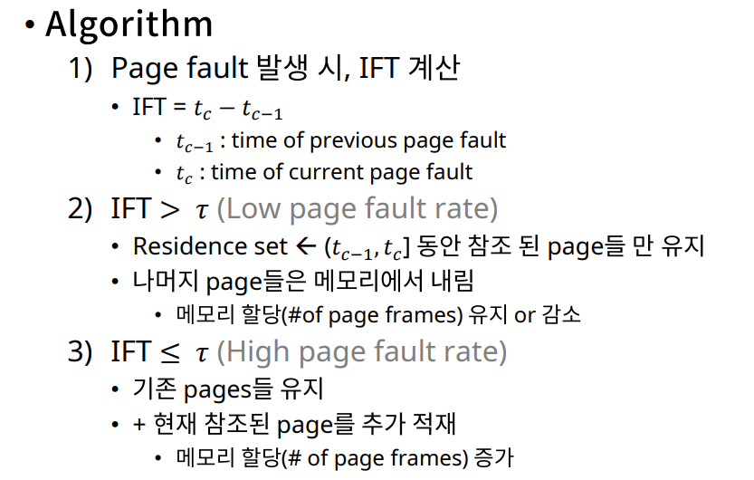
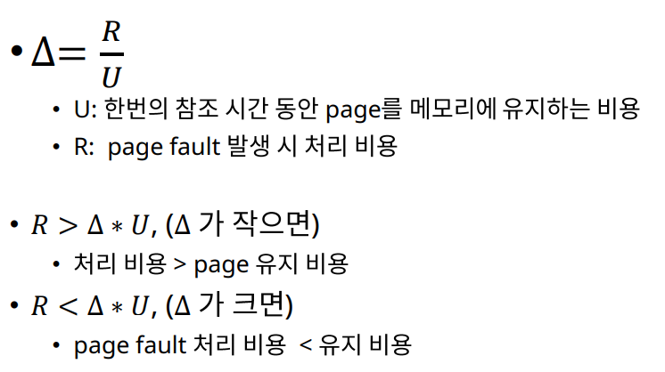
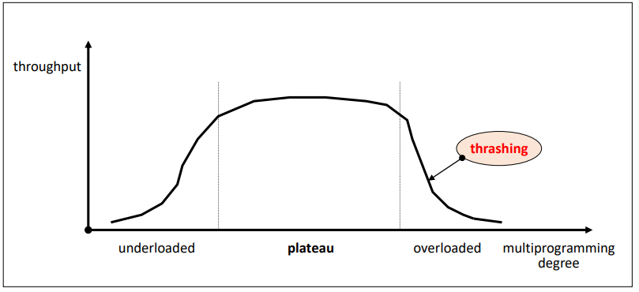

# [OS] Lecture 10.  Virtual Memory Management

### 가상 메모리 관리의 목적

- 성능 최적화
  - Cost model(일종의 성능지표)
  - 다양한 최적화 기법

## 1. Cost Model for Virtual Memory Sys.

- Page Fault frequency (발생 빈도)
- Page reference string (d)
  - 프로세스 수행 중 참조한 페이지 순서 번호
  - 알고리즘 평가 기준으로 사용
  - w = r1r2r3r4....rk....rn
    - ri = 페이지 번호
    - N : 프로세스의 페이지 수
- Page Fault rate (발생률)
  - F(w) 

- 즉 Page Fault를 최소화 하도록 전략설계가 필요하다.
  - Context switching 및 kernel 개입 최소화
  - 시스템 성능 향상

## 2. Hardware Components

- Address translation device (주소 사상 장치)

  - 주소 사상을 효율적으로 수행하기 위해 사용
    - Eg. TLB(associated memories), Dedicated page-table register, Cache memories

- Bit Vectors 

  - 0과 1이 array 형태로 있는 것

  - Page 사용 상황에 대한 정보를 기록하는 비트들

  - Reference bits (used bit) : 참조비트

    - 메모리에 적재된 각각의 page가 최근 참조되었는지 기록
    - 운영
      - 프로세스에 의해 참조되면 해당 page의 Ref.bit를 1로 설정
      - 주기적으로 모든 Ref.bit를 0으로 초기화
    - Ref.bit를 확안함으로서 최근 참조된 것을 알 수 있다.

    

  - Update bits (modified bits, write bits, dirty bits) : 갱신비트

    - Page가 메모리에 적재된 후, 프로세스에 의해 수정되었는지 표시
    - 주기적 초기화 없음
    - Update bit = 1
      - 해당 page의 (main Memory상 내용) != (Swap device의 내용)
      - 해당 page에 대한 Write-back (to swap device)이 필요

## 3. Software Components

### 성능 향상을 위한 관리기법들

- Allocation strategies (할당 기법)
- Fetch strategies 
- Placement strategies (배치기법)
- Replacement strategies (교체기법)
- Cleaning strategies (정리 기법)
- Load control strategies (부하 조절 기법)

### 1. Allocation strategies 

- 각 프로세스에게 메모리를 `얼만큼 할당`할 것인가?
  - Fixed allocation (고정할당)
    - 프로세스의 실행동안 고정된 크기의 메모리 할당
  - Variable allocation (가변할당)
    - 프로세스가 실행동안 할당된 메모리의 크기가 유동적
- 고려사항
  - 프로세스 실행에 필요한 메모리의 양을 예측해야 함
  - 너무 많은 메모리 -> 낭비됨 ㅠ.ㅠ
  - 너무 적은 메모리 -> Page Fault rate 증가, 시스템 저하

### 2. Fetch strategies 

- 특정 Page를 메모리에 `언제 적재`할 것인가?
  - Demand fetch (demand paging)
    - 프로세스가 참조하는 페이지들만 적재
    - Page fault overhead
    - 실제 대부분의 시스템이 채택한 방식
      - 일정하게 준수한 성능
      - 예측이 실패시, 자원 낭비가 너무 큼
  - Anticipatory fetch (pre-Paging)
    - 참조될 가능성이 높은 page 예측
    - 가까운 미래에 참조될 가능성이 높은 page를 미리 적재
    - 예측 성공시, page fault overhead가 없음
    - Prediction overhead (kernal이 개입), hit ratio에 민감함

### 3. Placement strategies

- Page/segment를 `어디에 적재`할 것인가?
- Paging system에는 불필요
- Segmentation Sys.에서 배치 기법
  - First-fit
  - Best-fit
  - Worst-fit
  - Next-fit

### 4. Replacement strategies

- 새로운 page를 `어떤 page와 교체`할 것인가? (빈 page frame이 없는 경우)
- 나중에 하나씩 다룰 예정
- `Locality`
  - 프로세스가 프로그램/데이터의 특정 영역을 집중적으로 참조하는 현상

### Fixed allocation을 위한 교체기법

- **Min Algorithm (OPT algorithm)**
  - minimize page fault frequency (Proved)
    - Optimal solution
  - 기법
    - 앞으로 가장 오랫동안 참조되지 않을 page 교체
      - Tie-breaking rule : page 번호가 가장 큰/ 작은 페이지 교체
  - 실현 불가능 (Unrealizable)
    - `Page reference string`을 미리 알고있어야함 (출석부가 있어야 됨)
  - 교체 기법의 성능 평가 도구로 사용됨

- **Random Algorithm**
  - 무작위로 교체할 page 선택
  - Low overhead
  - No policy

- **FIFO Algorithm**
  - 가장 오래된 Page를 교체
  - Page가 적재된 시간을 알아야함
  - 자주 사용되는 page가 교체될 가능성이 있음
    - `Locality`를 고려하지 않음
  - `FIFO anomaly`
    - FIFO알고리즘의 경우, 더 많은 page frame을 할당받았음에도 불구하고, page fault가 증가하는 경우 발생

- **LRU Algorithm**
  - 가장 오랫동안 참조되지 않은 page를 교체
  - Page 참조시마다 시간을 기록해야 함
  - Locality에 기반을 둔 교체방식
  - Min algorithm에 근접한 성능을 보여줌
  - 실제로 가장 많이 활용
  - 단점
    - 참조 시마다 시간을 기록해야 함 (Overhead)
      - 간소화 된 정보 수집으로 해소 가능 : 순서만 기록
    - Loop 실행에 필요한 크기보다 작은 수의 Page frame이 할당된 경우, Page fault가 급격히 증가함

- **LFU Algorithm**
  - 가장 참조 횟수가 적은 Page를 교체
    - Tie-breaking rule : LRU
  - page 참조 시마다, 참조 횟수를 누적 시켜야 함
  - Locality 활용
    - LRU 대비 적은 overhead
  - 단점
    - 최근 적재된 참조될 가능성이 높은 Page가 교체될 가능성이 있음
    - 참조 횟수 누적 overhead

- **NUR Algorithm**
  - LRU보다 적은 overhead로 비슷한성능 달성 목적
  - Bit vector 사용
    - Ref.bit vector (r), Update bit vector (m)
  - 교체 순서
    - (0, 0)
    - (0, 1)
    - (1, 0)
    - (1, 1)

- **Clock Algorithm** 
  - Ref.bit 사용함
    - 주기적인 초기화 없음
  - Page frame들을 순차적으로 가리키는 pointer를 사용하여 교체될 page 결정
    - 현재 가리키고 있는 page의 Ref.bit(r) 확인
    - r = 0 , 교체 Page로 결정
    - r = 1, Ref.bit 초기화 후, 다시 돌리기
  - 먼저 적재된 page가 교체될 가능성이 높음 (Like FIFO)
  - Ref.bit를 사용하여 교체 페이지 결정 (Like LRU, NUR)

- **Second Chance Algorithm**
  - Clock Algorithm과 유사
  - Update bit(m) 도 같이 고려함
    - 현재 가리키고 있는 page의 (r, m) 확인
    - (0, 0) -> 교체됨
    - (0, 1) -> (0,0)으로 변경 후, Write-back list에 추가
    - (1, 0) -> (0, 0)
    - (1, 1) -> (0, 1)

### Variable allocation을 위한 교체기법

- **Working Set (WS) Algorithm**

  - `Working Set`
    - Process가 특정 시점에 자주 참조하는 `page들의 집합`
    - 최근 일정시간동안(Δ) 참조된 page들의 집합
    - 시간에 따라 변함
    - `W(t, Δ)`
      - Time interval [t-Δ, t] 동안 참조된 pages들의 집합
      - Δ : Window Size

  

  

  - Working set Memory management
    - Locality에 기반을 둠
    - Working set을 메모리에 항상 유지
      - Page fault rate(`Thrashing` 감소)
      - 시스템 성능 향상
    - Window size(Δ)는 고정
      - Memory allocation은 가변
        - if MA 고정 and Δ는 가변 -> LRU
      - Δ값이 성능을 결정짓는 중요 factor

  

  - Window Size vs. WS size

    

  

  

  - Working set transition
    - WS size에 맞게 allocation되s Pageframe의 수를 변경하는 것!
  - 성능 평가
    - Page fault 수 외 다른 지표도 파악할 필요 있음
    - Time interval이나 할당된 page frame 등도 모두 고려한 평균을 내야함
  - 특성
    - 적재되는 page가 없더라고, 메모리를 반납하는 page가 있을 수 있음
    - 새로 적재되는 page가 있더라고, 교체되는 page가 없을 수 있음
  - 단점
    - Working set Management overhead
    - Residence set(상주 집합)을 Page fault가 없더라고, 지속적으로 관리해야함

- **Page Fault Frequency(PFF) Algorithm**

  - Residence Set size를 `page fault rate`에 따라 결정

    - Low Page fault rate -> Process에 할당된 PageFrame 수를 감소
    - High page fault rate -> Process에 할당된 PageFrame 수를 증가

  - Resident set 갱신 및 메모리 할당

    - Page fault가 발생시에만 수행
    - Low overhead

  - Criteria for page fault rate

    - IFT > T : Low Page fault rate
    - IFT < T : High page fault rate
    - T : Threshold value
      - System parameter

    

    

  - 성능 평가

    - Page fault 외에도 다른 지표도 고려해야 함

  - 특징

    - 메모리 상태 변화가 Page fault 발생 시에만 변함
      - Low overhead

    

- **Variable Min (VMIN) Algorithm**

  - Optimal Algorithm(실현 불가능한 기법)

    - 평균 메모리 할당량과 Page fault 발생 횧수를 모두 고려했을 때, Optimal
    - Page reference String을 알고 있어야 함

  - 기법

    - [t, t+Δ]을 고려해서 교체할 Page 선택

  - Algorithm

    - Page r이 t시간에 참조 되면, Page r이 (r, t+Δ] 사이에 다시 참조되는지 확인

    - 참조된다면, page r 유지

      아니면, 메모리에서 내림

  - 성능 평가
    - Page fault 수 이외에도 다른 지표도 고려해야 함
  - `최적 성능을 위한 Δ값`은 ?!?
    - `Page Fault 처리비용` == `Page 유지비용` 일 때 최적

  

### 5. Cleaning strategies

- 변경된 page를 `언제 Write-back` 할것인가?

  - 변경된 내용을 Swap device에 반영

  - Demand cleaning

    - 해당 page에 메모리에서 내려올 때 진행
    - Fetch 전략에서와 동일한 이유로 일반적으로 사용

  - Anticipatory cleaning

    - 더 이상 변경될 가능성이 없다고 반단 될 때, 진행

    - 시간절약이 가능하지만, 변경하고 또 수정되면 overhead

      

### 6. Load Control strategies

- 시스템의 multi-Programming degree 조절 (부하 조절)
  - Allocation strategies와 연계 됨
- 적정 수준의 multi-Programming degree를 유지해야함
  - Plateau(고원) 영역으로 유지
  - 저부하 상태 (Under-load)
    - 시스템자원 낭비, 성능저하
  - 고부하 상태 (Over-load)
    - 자원에 대한 경쟁 심화, 성능 저하
    - `Thrasing(스레싱)` 현상 발생
      - 과도한 page fault가 발생하는 현상

### 7. 기타 고려사항

### Page Size

- 시스템 특성에 따라 다름 
  - No best Answer (적당히가 최고!)
  - 점점 커지는 경향
- 일반적인 Page Size
  - 128bites ~ 4M bytes

|    항목     | Small Page Size | Large Page Size |
| :---------: | :-------------: | :-------------: |
|  Overhead   |      High       |       Low       |
| 내부 단편화 |      감소       |      증가       |
|   I/O시간   |      증가       |      감소       |
|  Locality   |      증가       |      감소       |
| Page fault  |      증가       |      감소       |

-> 최근 HW의 발전 사항을 보면 CPU와 DISK의 성능 차이가 점점 증가하는 중 (CPU 성장이 빠르다)

-> DISK가 I/O bottleneck 상황 발생

-> DISK의 I/O 시간을 낮추자!!

-> 점점 큰 Page size 요구됨

### Programming Restructuring

- 가상 메모리 시스템의 특성에 맞도록 프로그램 재구성
- 사용자가 가상 메모리 관리 기법을 알면, 프로그램 구조를 수정해 성능 향상가능

### TLB Reach

- TLB(Translation Look-aside Buffer)를 통해 접근할 수 있는 메모리 양 (닿는 거리!)
  - (The number of entries) * page size
- TLB의 hit ratio를 높이려면, 
  - TLB의 크기 증가
    - Expensive
  - Page 크기 증가 or 다양한 page size 지원
    - OS의 지원이 필요
      - 최근 OS의 발전 경향

###### 	*이  [강의](https://www.youtube.com/playlist?list=PLBrGAFAIyf5rby7QylRc6JxU5lzQ9c4tN)를 통해 공부하고 배운 내용을 정리하였습니다.