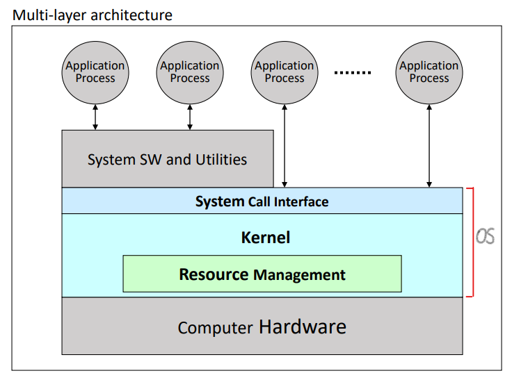
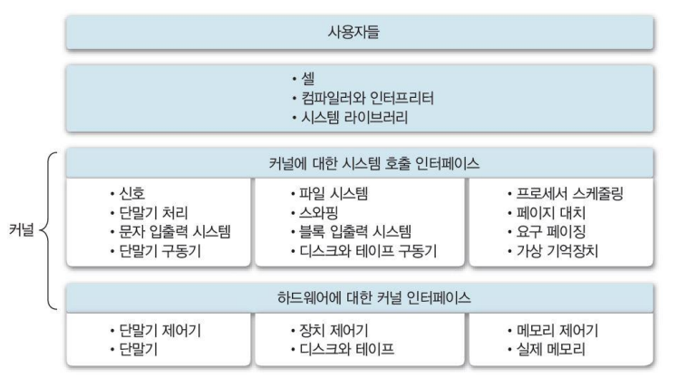
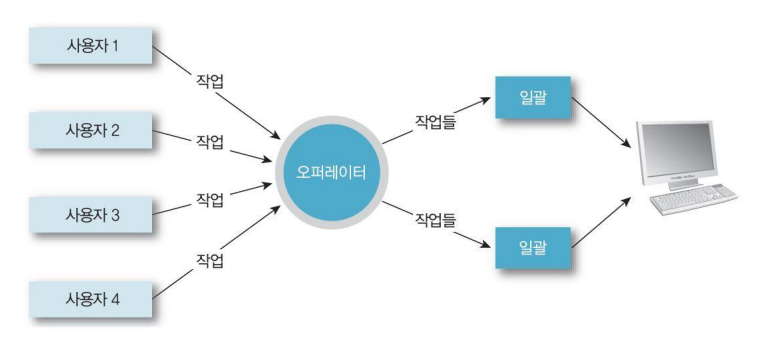
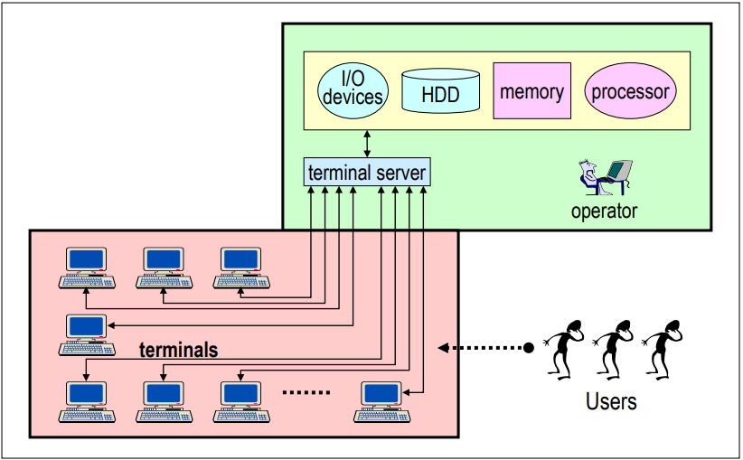
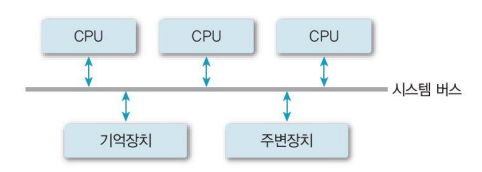
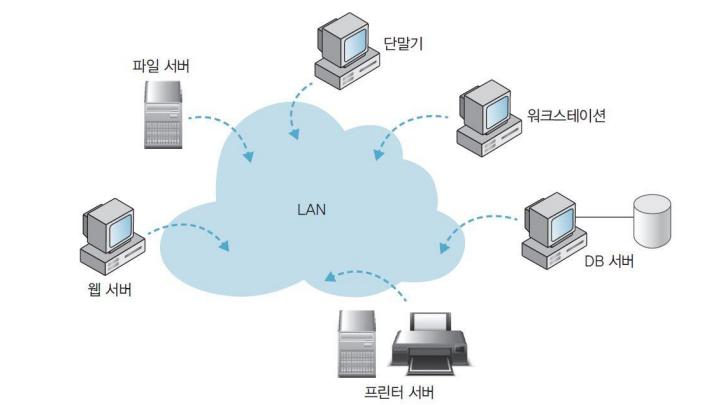
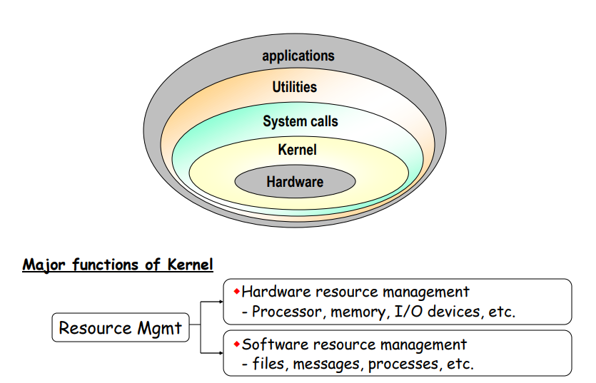
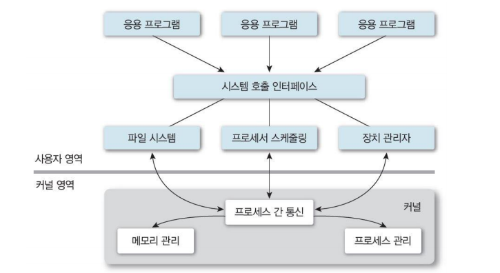
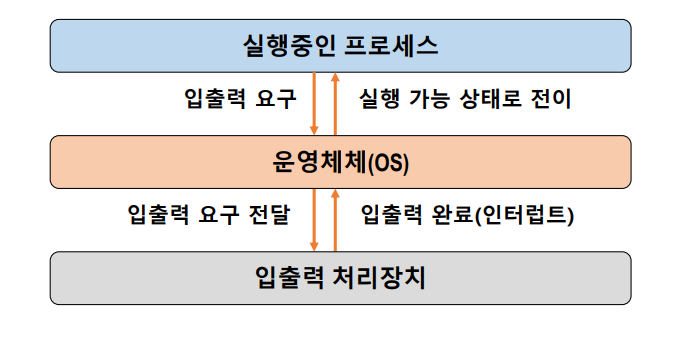
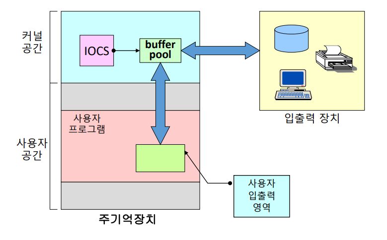

# [OS] Lecture 2. Operating Systems Overview

## 1. 운영체제의 역할

- **User Interface (편리성)**
  
  - CUI (Character User Interface)
    - 문자 기반으로 보여줌
  - GUI (Graphical User Interface)
    - 현재 OS 는 대체로 그래픽 형태로 보여줌
  - EUCI (End-User Comfortable Interface)
    - 특정 유저/기기에 특화된 UI형태
  
- **Resource Management (효율성)**

  - HW resource : processor, memory, I/O devices, Etc.

  - SW resource : file, application, message, signal, Etc.

- **Process and Thread management**

- **System management (시스템보호)**

## 2. 컴퓨터 시스템의 구성

- System Call Interface 
  - User가 Kernel에 직접적으로 접근하지 못하게 막고, `System Call Interface`를 통해 요청하는 형태.
  - `Kernel`이 제공하는 기능 중 사용자가 직접 사용할 수 있는 기능들만 모아놓은 곳이라 생각하면 된다!

## 3. 운영체제의 구분

- 동시 사용자 수

  - Single-user system(단일 사용자)
    - 한명의 사용자만 시스템 사용가능
      - 한명의 사용자가 모든 시스템 자원 독점
      - 자원 관리 및 시스템 보호가 용이
    - 개인용 장비(PC, mobile)등에 주로 사용 : Windows 7/10, MS-DOS, android 등
  - Multi-user system(다중 사용자)
    - 동시에 여러 사용자들이 시스템 사용
      - 각종 시스템 자원들에 대한 소유 `권한 관리` 필요
      - 기본적으로 `Multi-tasking`기능 필요
      - OS구조가 복잡
    - 서버, 클러스터(cluster) 장비 등에 사용 : Unix, Linux, Windows server 등

- 동시 실행 프로세스 수

  - Single-tasking system(단일 작업)
    - 시스템 내에 하나의 작업(프로세스)만 존재
    - 운영체제 구조 간단
    - ex) MS-DOS
  - Multi-tasking system(다중 작업)
    - 동시에 여러 작업(프로세스)의 수행 가능
      - 작업들 사이에 동시수행, 동기화 등을 관리해야한다.
    - 운영체제 기능 및 구조가 복잡

- 작업 수행 방식

  - **순차처리(No OS ~ 1940s)**

    - 운영체제 개념 존재 X
      - 사용자가 기계어로 직접 프로그램 작성
      - 컴퓨터에 필요한 모든 작업 프로그램에 포함
        - 프로세서에는 명령어 저장방법, 계산 대상, 결과 저장 위치와 방법, 출력시점, 위치 등
    - 실행하는 작업 별 순차 처리
      - 각각의 작업에 대한 준비시간이 소요

  - **Batch processing system(일괄 처리 시스템, 1950s~1960s)**

    

    - 모든 시스템을 중앙(전자 계산소 등)에서 관리 및 운영
    - 사용자의 요청 작업(천공 카드 등)을 일정시간 모아두었다가 한꺼번에 처리
    - 시스템 지향적(Systme-oriented)
    - 장점
      - 많은 사용자가 시스템 자원 공유
      - 처리효율(Throughput) 향상
    - 단점
      - 생산성(productivity) 저하
        - 같은 유형의 작업이 충분히 모여야함
      - 긴 응답시간 (turnaround time)
        - 약 6시간

  

  - **Time-sharing system(시분할 시스템, 1960s ~ 1970s)**

    

    - 여러 사용자가 자원을 동시에 사용
      - OS가 파일 시스템 및 가상 메모리 관리
    - 사용자 지향적(user-oriented)
      - 대화형 시스템
      - 단말기 사용
    - 장점
      - 응답시간 단축 (약 5초)
      - 생산성 향상 : 프로세서 유휴 시간 감소
    - 단점
      - 통신 비용 증가
      - 개인 사용자 체감 속도 저하
        - 동시 사용자수 증가 -> 시스템 부하 -> 느려짐(개인관점)

  - **Personal Computing**

    - 개인이 시스템 전체를 독점
    - CPU 활용률(utilization)이 고려 대상이 아님
    - OS가 단순함
    - 응답시간이 빠르지만 성능(performance)가 낮다

  - **Parallel Processing System(병렬 처리 시스템)**

    - 단일 시스템 내에서 둘 이상의 프로세서 사용

    - 메모리 등 자원 공유(Tightly-coupled system)

    - 성능 및 신뢰성 향상

      - CPU 하나가 고장나더라도 정상 작동

    - 프로세서간 관계 및 역할 관리 필요

      

  - **Distributed processing system(분산 처리 시스템)**

    

    - 네트워크를 기반으로 구축된 병렬처리 시스템(`Loosely-coupled system`)
      - 물리적인 분산, 통신망 이용한 상호 연결
      - 각각 운영체제 탑재한 다수 범용 시스템으로 구성
      - 사용자는 `분산 운영체제`를 통해 하나의 프로그램, 자원처럼 사용 가능 (은폐성, transparency)
      - 각 구성 요소들간의 독립성 유지, 공동 작업 가능
      - Cluster system, clinet-server, P2P 등
    - 장점
      - 자원 공유로 인한 높은 성능
      - 고신뢰성, 높은 확장성
    - 단점
      - 구축 및 관리가 어려움

  - **Real-time system(실시간 시스템)**

    - 작업처리에 제한시간(deadline)을 갖는 시스템
      - 제한시간 내 서비스를 제공하는 것이 자원 활용 효율보다 중요
    - 작업(Task)의 종류
      - Hard real-time task
        - 시간 제약을 지키지 못하면 시스템에 치명적
        - ex) 발전소, 무기제어 등
      - Soft real-time task
        - ex) 동영상 재생 등
      - Non real-time task

## 4. 운영 체제의 구조

- 커널(Kernel)
  - OS의 핵심 부분(`메모리 상주`)
  - 가장 빈번하게 사용되는 기능들 담당
    - 시스템 관리(processor, memory, Etc) 등

- 유틸리티(Utility)
  - 비상주 프로그램
  - UI 등 서비스 프로그램

### 단일 구조

- 장점
  - 커널 내 모듈간 직접 통신
  - 효율적 자원 관리 및 사용 가능
- 단점
  - 커널의 거대화
    - 오류 및 버그, 추가기능 구현 등 유지보수의 어려움
    - 동일 메모리에 모든 기능이 있어, 한 모듈의 문제가 전체 시스템에 영향

### 계층 구조

- 장점 
  - 모듈화
    - 계층간 검증 및 수정 편함
  - 설계 및 구현의 단순화
- 단점
  - 단일구조 대비 성능 저하
    - 원하는 기능 수행을 위해 여러 계층을 거쳐야함

### 마이크로 커널 구조

- 커널의 크기 최소화
  - 필수 기능만 포함
  - 기타 기능은 사용자 영역에서 수행

## 5. 운영체제의 기능

- **프로세스(Process) 관리**

  - 프로세스(process)
    - 커널에 등록된 실행 단위(실행중인 프로그램)
    - 사용자 요청/프로그램의 수행 주체(entity)
  - OS의 프로세스 관리 기능
    - 생성/ 삭제, 상태관리
    - 자원할당
    - 프로세스간 통신 및 동기화(Synchronization)
    - 교착상태(deadlock) 해결
  - 프로세스 정보 관리
    - PCB(Process Cintrol Bloc)

- **프로세서(Processor) 관리**

  - 중앙처리 장치(CPU)
    - 프로그램을 실행하는 핵심 자원 
  - 프로세스 스케줄링
    - 시스템 내의 프로세스 처리 순서 결정
  - 프로세스 할당 관리
    - 프로세스들에 대한 프로세서 할당 및 회수
      - 한번에 하나의 프로세스만 사용 가능

- **메모리(Memory) 관리**

  - 주기억 장치
    - 작업을 위한 프로그램 및 데이터를 올려놓는 공간
  - `Multi-user`, `Multi-tasking` 시스템
    - 프로세스에 대해 메모리 할당 및 회수
    - 메모리 여유 공간 관리
    - 각 프로세스의 할당 메모리 영역 접근 보호
  - 메모리 할당 방법(Scheme)
    - 전체 적재
      - 장점: 구현이 간단
      - 단점: 제한적 공간
    - 일부 적재(virtual memory concept)
      - 프로그램 및 데이터의 일부만 적재
      - 장점 : 메모리의 효율적 활용
      - 단점 : 보조기억 장치 접근 필요

- **파일(File) 관리**

  - `파일` : 논리적 데이터 저장단위
  - 사용자 및 시스템의 파일 관리
  - 디렉토리 구조 지원
  - 파일 관리 기능
    - 파일 및 디렉토리 생성 / 삭제
    - 파일 접근 및 조작
    - 파일을 물리적 저장공간으로 사상 (mapping)
    - 백업 등

- **입출력(I/O) 관리**

  - 반드시 OS를 거쳐야 함

  

  

- **보조 기억 장치 및 기타 주변장치 관리 등**

  - Disk
  - Networking
  - Security and Protection system
  - Command interperter system
  - System call interface
    - 응용 프로그램과 OS 사이의 인터페이스
    - OS가 응용프로그램에 제공하는 서비스

###### 	*이  [강의](https://www.youtube.com/watch?v=nxl_cUd55Ag&list=PLBrGAFAIyf5rby7QylRc6JxU5lzQ9c4tN&index=2)를 통해 공부하고 배운 내용을 정리하였습니다.