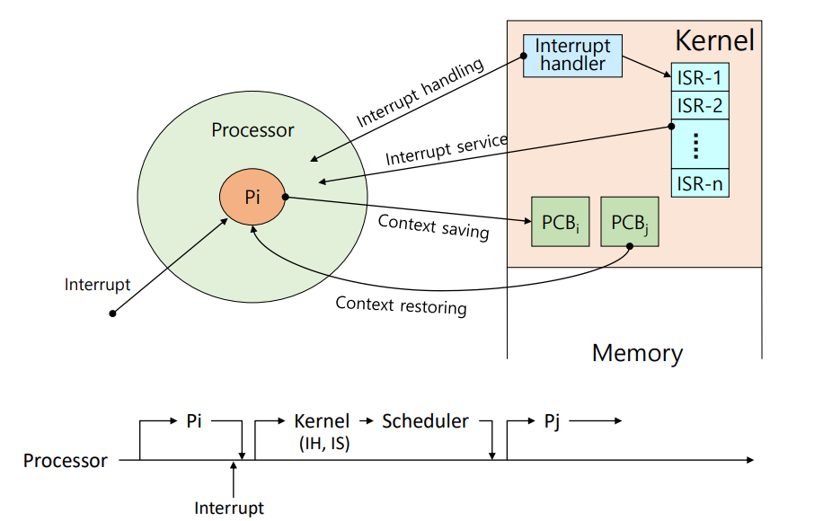

# [OS] Lecture 3. Process Management

## 1. Job vs Process

- `작업(job)` / `프로그램(Program)`
  
  - 실행할 프로그램 + 데이터
  - 컴퓨터 시스템에 실행 요청 전의 상태
  
- `프로세스(Process)`
  
  - 실행을 위해 시스템(커널)에 등록된 작업
  - 시스템 성능 향상을 위해 커널에 의해 관리됨
    - 이게 바로 운영체제의 역할 중 하나
  
  

## 2. 프로세스의 정의

- 실행중인 프로그램 : 이 중 하나쯤은 외워둘 것!
  - 커널에 등록되고 커널의 `관리하에` 있는 작업
  - 각종 자원들을 요청하고 할당 받을 수 있는 개체
  - `프로세스 관리 블록(PCB)`을 할당 받은 개체
    - PCB :
      - 커널 공간(Kernel space) 내에 존재
      - 각 프로세스들에 대한 정보를 관리
  - 능동적인 개체(active entity)
    - 실행 중에 각종 자원을 요구, 할당, 반납하여 진행

## 3. 프로세스의 종류

## 4. 자원(Resource)란?

> 커널의 관리 하에 프로세스에게 할당/반납되는 수동적 개채(passive entity)

- 자원의 분류
  - H/W resources
    - processor, memory, disk, monitor, keyboard, Etc
  - S/W resources
    - Message, Signal, files, installed SWs, Etc

## 5. Process Control Block(PCB)

> Process를 제어하기 위해 필요한 블록집단!
>
> 프로세스 생성시, PCB 도 생성된다.

- ### `PCB` 가 관리하는 정보들

  - PID : Process Identification Number
    - 프로세스 고유 식별 번호
  - 스케줄링 정보
    - 프로세스 우선 순위 등과 같은 스케줄링 관련 정보들
  - 프로세스 상태
    - 자원할당, 요청 정보 등
  - 메모리 관리 정보
    - Page table, segment Table 등
  - 입출력 상태 정보
    - 할당 받은 입출력 장치, 파일 등에 대한 정보 등
  - 문맥 저장 영억(contect save area)
    - 프로세스의 레스터 상태를 저장하는 공간 등
  - 계정 정보 ( 다중 사용자 시스템의 경우! )
    - 자원 사용 시간 등을 관리

  **-> `PCB 정보`는 OS 별로 상이하며, `PCB 참조 및 갱신속도`는 OS 성능에 주요 Factor!!**

## 6. 프로세스의 상태(Process States)

> `Process` - `Resource`간의 상호작용에 의해 결정

- ### **Process State Transition Diagram**

### 1. Created State

- `작업(Job)`을 커널에 등록

- PCB 할당 및 프로세스 생성

- 커널

  - 가용 메모리 공간 확인 및 프로세스 상태로 전이
    - 메모리가 충분하다!? ->  `Ready` 
    - 메모리가 부족  - > `Suspended ready`

  

### 2. Ready State

- 프로세서 외의 모든 메모리를 할당 받은 상태
  - 프로세서(CPU)할당 대기 상태
  - 즉시 실행 가능 상태
- DIspatch(or Schedule)
  - `Ready` 에서 프로세서를 할당 받았다!? - > `Running state`가 되었다. (Dispatch 됐다.) \

### 3.Running State

- 프로세서와 필요한 자원을 모두 할당 받은 상태

- Preemption
  - Running state - > `Ready state`
  - 할당 받은 `프로세서`가 다시 반납된 상태
  - 프로세서 스케줄링(e.g, Time-out, Priority changes)
- Block/sleep
  - Running state -> `asleep state`
  - I/O등 자원 할당 요청(I/O 대기 중)
  - 자원을 추가적으로 필요로 함

### 4. Blocked/ Asleep State

- 프로세서 외의 다른 자원을 기다리는 상태
  - 자원 할당은 System call에 의해 이루어짐
- Wake-up
  - Asleep state - > `Ready state` -> `Running state`
  - 바로 `running state`로 가면 안됨!! 다시 줄서잇!?!

### 5. Suspended State

- `메모리`를 할당 받지 못한 (빼앗긴) 상태
  - Memory Image를 swap device에 보관
    - `swap device` : 프로그램 정보 저장을 위한 특별한 파일 시스템
    - 메모리를 뺏기기전에 `Memory image` 형태로 저장해놨다가 복구할 때 사용
  - 커널 또는 사용자에 의해 발생
- Swap-out(suspended), Swap-in(resume)

### 6. Terminated/Zombie State

- 프로세스 수행이 끝난 상태
- 모든 자원 반납 후, 커널 내 일부 PCB 정보만 남아있는 상태
  - 이후 프로세스 관리를 위해 정보 수집
  - 나중 동일 작업 진행할 때, 수집한 정보 활용하도록!

## 7. 프로세서 자료 구조

- Ready Queue 
- I/O Queue 
- Device Queue

## 8. 인터럽트(Interrupt)

- 예상치 못한, 외부에서 발생한 이벤트
  - Unexpected, external events
- 인터럽트의 종류
  - I/O interrupt
  - Clock interrupt
  - Console interrupt
  - Program check interrupt
  - Machine check interrupt
  - Inter-process interrupt
  - System call interrupt

### 인터럽트 처리 과정

- Interrupt 발생 시, 일단 `커널`이 개입 + 프로세스 일시 중단
- `Context`란?
  - 프로세스와 관련된 정보들의 집합
    - CPU register context --> in CPU
    - Code & data, stack, PCB --> in Memory
- 이때, `Context saving` 발생
  - 현재 프로세스의 Register context를 저장하는 작업
- `Interrupt Handling` 
  - 어디서 문제가 발생했는지 파악
- `Interrupt Service`
  - 해당 문제를 해결하는 프로그램 실행
- `Context restoring`
  - Register context를 프로레스로 복구하는 작업

- `Context switching`
  - 실행중인 프로세스의 Context를 저장(`Context saving`)하고 앞으로 실행할 프로세스의 Context를 복구(`Context restoring`)하는 일
    - 커널의 개입이 이루어짐

- Context Switch Overhead
  - context switching에 소요되는 비용
    - OS마다 다름
    - OS 성능에 큰 영향을 줌
  - 불필요한 Context switching을 줄인다!!
    - Thread를 사용!!

###### 	*이  [강의](https://www.youtube.com/playlist?list=PLBrGAFAIyf5rby7QylRc6JxU5lzQ9c4tN)를 통해 공부하고 배운 내용을 정리하였습니다.