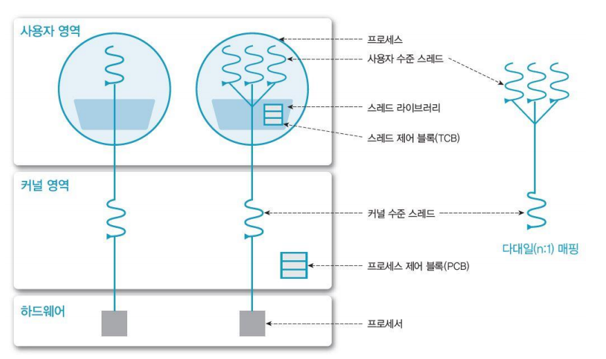

# [OS] Lecture 4. Thread Management

## 1. `Thread`란?

> 프로세스의 자원을 할당하고 프로세스가 제어하는 부분에서 `제어!!`부분만 뚝 떼어온 것!
>
> 실 형태로 표시하며, 여러개 존재!!!!!!!!!!!! 가능하다.

- `Light Weight Process(LWP)` : 가벼운 프로세스!
- 프로세서(eg. CPU) 활용의 기본 단위
- 구성요소
  - Thread ID
  - Resigter set (PC, SP 등)
  - Stack (i.e. local data)
- 제어요소 외 코드, 데이터 및 자원들은 프로세스 내 다른 스레드들과 공유
- 전통적 프로세스 = 단일 스레드 프로세스

### Thread의 구조

### Thread의 공간 주소

### Single Thread vs Multi Thread

### Thread의 장점

- **사용자 응답성 (Responsiveness)**
  - 일부 스레드의 처리가 지연되어도, 다른 스레드는 작업을 계속 처리 가능
- **자원 공유 (Resource sharing)**
  - 자원을 공유해서 효율성 증가 (커널의 개입을 피할 수 있음)
    - ex) 동일 address space에서 스레드 여러개 존재
- **경제성 (Economy)**
  - 프로세스의 생성, context switch에 비해 효율적
- **멀티 프로세서 (Multi-processer) 활용**
  - 병렬처리를 통해 성능 향상

## Thread의 구현

1. 사용자 수준 Thread(User Thread)

   - 사용자 영역의 `스레드 라이브러리`로 구현됨
     - 스레드의 생성, 스케줄링 등
     - POSIX threads, Win32 threads, Java thread API 등

   - 커널은 스레드의 존재를 모름
     - 커널의 관리(개입)를 받지 않음
       - 생성 및 관리의 부하가 적음, 유연한 관리 가능
       - 이식성 (Portability)이 높음
     - 커널은 프로세스 단위로 자원 할당
       - 하나의 스레드가 block 상태가 되면, 모든 스레드가 대기
         - Single-threaded kernel의 경우

2. 커널 수준 Thread (Kernel Threads)
   - OS (kernel)이 직접 관리
   - 커널 영역에서 스레드의 생성, 관리 수행
     - Context switching 등 부하(Overhead)가 크다. // **사용자 수준과 비교시 !**
   - 커널이 각 스레드를 개별적으로 관리
     - 프로세스 내 스레드들이 병행 수행 가능
       - 하나의 스레드가 block상태가 되어도, 다른 스레드는 계속 작업 수행 가능

3. 혼합형(n:m) Thread
   - n개 사용자 수준 스레드 - m개 커널 스레드 ( n >= m)
     - 사용자는 원하는 수만큼 스레드 사용
     - 커널 스레드는 자신에게 할당된 하나의 사용자 스레드가 block 상태가 되어도, 다른 스레드 수행 가능
       - **병행처리 가능**
   - 효율적이면서도 유연하다!

###### 	*이  [강의](https://www.youtube.com/playlist?list=PLBrGAFAIyf5rby7QylRc6JxU5lzQ9c4tN)를 통해 공부하고 배운 내용을 정리하였습니다.