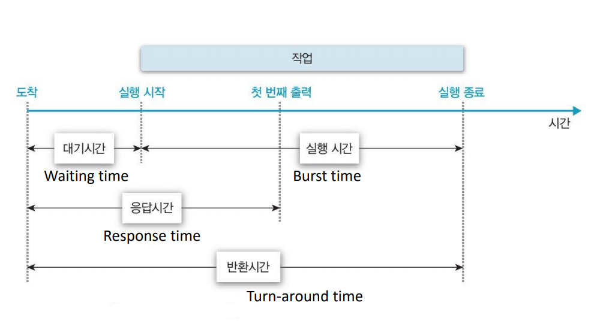
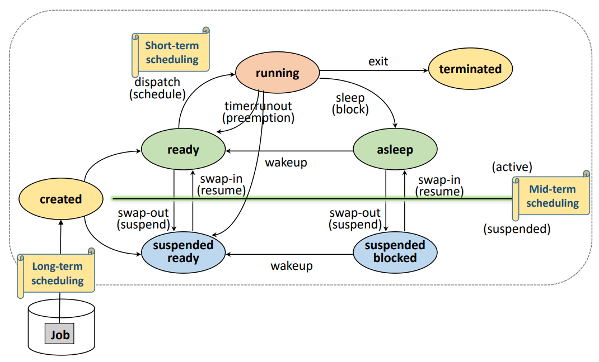

# [OS] Lecture 5-1. Process Scheduling

## 1. `Scheduling`이란?

> 우리가 사용하는 시스템은 `다중프로그래밍(Multi-programming)`이다
>
> 즉, 여러 개의 프로세스가 시스템 내의 존재하며 **자원을 할당 할 프로세스를 선택해야함.**
>
> 이를 `스케줄링(Scheduling)`이라 한다!

- 자원 관리
  - **시간 분할 (Time sharing) 관리**
    - 하나의 자원을 여러 스레드들이 번갈아 가며 사용
    - 예) 프로세서 (Processor)
    - 프로세스 스케쥴링(Process Scheduling)
      - 프로세서 사용 시간을 프로세스들에게 분배
  - **공간 분할 (Space sharing) 관리**
    - 하나의 자원을 분할하여 동시에 사용
    - 예) 메모리(Memory)

### 스케줄링의 목적

- 시스템 성능(Performance) 향상
- 대표적 시스템 성능 지표(index)
  - 응답시간 (response time)
    - 작업 요청(submission)으로부터 응답을 받을 떄까지의 시간
    - 사용자 지향적
    - `Interactive`, `Realtime system`에서 가장 중요시 해야할 지표
  - 작업 처리량 (Throughput)
    - 단위 시간동안 완료된 작업의 수
    - 시스템 지향적
    - `Batch system`에서 가장 중요시 해야할 지표
  - 자원 활용도 (resource utiization)
    - 주어진 시간 (Tc)동안 자원이 활용된 시간(Tr)
    - `Utilization` = Tr/Tc
    - 비싼 장비에서 가장 중요시 해야할 지표
  - 그 외의
    - 공평성(Fairness)
      - FIFO
    - 실행 대기 방지
      - 무기한 대기 방지
    - 예측 가능성 (Predictability)
      - 적잘한 시간 안에 응답을 보장하는가
- 목적에 맞는 지표를 고려하여 스케줄링 기법을 선택

### 대기시간, 응답시간, 반환시간의 관계

## 2. 스케줄링 기준 및 단계

> 스케줄링 기법이 고려하는 항목들과 그것들의 우선순위

- 프로세스(Process)의 특성
  - `I/O-bounded` or `compute-bounded` 
- 시스템 특성
  - `Batch system` or `Interactive system`
- 프로세스의 긴급성 (Urgency)
  - `Hard-, Soft-, non- real time System`
- 프로세스의 우선순위 (Priority)
- 프로세스 총 실행시간 (Total service time)

### CPU burst vs. I/O burst

- 프로세스 수행 = CPU 사용 + I/O 대기
- CPU brust : CPU 사용시간 
- I/O burst : I/O 대기시간
- `compute-bounded` : CPU brust > I/O burst
- `I/O-bounded` : CPU brust < I/O burst

### 스케줄링의 단계 (Level)

> 발생하는 빈도 및 할당 자원에 따른 분류
>
> Long / Mid/ Short term Scheduling으로 분류

1. Long-term Scheduling
   - 장기 스케줄링
   - Job Scheduling
     - 시스템에 제출 할 (Kernel에 등록할) 작업 (Job) 결정
       - Admission scheduling, High-level Scheduling
   - 다중 프로그래맹 정도(degree) 조절
     - 시스템 내 프로세스 수 조절
   - `I/O-bounded` or `compute-bounded` 프로세스 들을 잘 섞어서 선택해야!!
   - 시분할 시스템에서는 모든 작업을 시스템의 등록
     - Long-term Scheduling이 불필요!
2. Mid-term Scheduling
   - 중기 스케줄링
   -  메모리 할당 결정 (Memory allocation)
     - Intermediate-level scheduling
     - Swapping (Swap-in/ swap-out)
3. Short-term Scheduling
   - 단기 스케줄링
   - Process Scheduling
     - Low-level scheduling
     - 프로세서(Processer)를 할당할 프로세스(Process)를 결정
       - Processor Scheduler, dispatcher
   - 가장 빈번하게 발생
     - Interrupt, Block(I/O), time-out, Etc.
     - **매우 빨라야함!!!!!**

## 3. 스케줄링 정책 (Policy)

- 선점 vs 비선점
  - Preemptive Scheduling,  Non-Preemptive Scheduling
- 우선순위
  - Priority

### 3-1. Preemptive / Non-Preemptive Scheduling

> 선점 : 누가 와서 뺏어갈 수 있음!!!

- Non-Preemptive scheduling
  - 할당 받은 자원을 `스스로 반납`할 때 까지 사용
    - ex) System call, I/O
  - 장점
    - `context switch overhead`가 적음
  - 단점
    - 잦은 우선순위 역전, 평균 응답시간 증가
- Preemptive scheduling
  - 타의에 의해 자원을 빼앗길 수 있음
    - ex) 할당시간 종료,  상위 우선순위의 등장
  - `context switch overhead`가 큼
  - Time-sharing system, real-time system 등에 적합

### 3.2 Priority

- 프로세스의 중요도
- Static Priorty (정적 우선순위)
  - 프로세스 생성 시 결정된 Priorty가 유지됨
  - 장점
    - 구현이 쉽고, Overhead가 적음
  - 단점
    - 시스템 환경 변화에 대한 대응이 어려움
- Dynamic Priority (동적 우선순위)
  - 프로세스 상태 변화에 따라 Priority 변경
  - 구현이 복잡, Priority 재계산 Overhead가 큼
  - 시스템 환경 변화에 유연한 대응 가능

###### 	*이  [강의](https://www.youtube.com/playlist?list=PLBrGAFAIyf5rby7QylRc6JxU5lzQ9c4tN)를 통해 공부하고 배운 내용을 정리하였습니다.