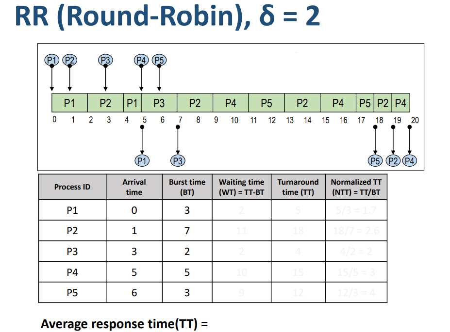
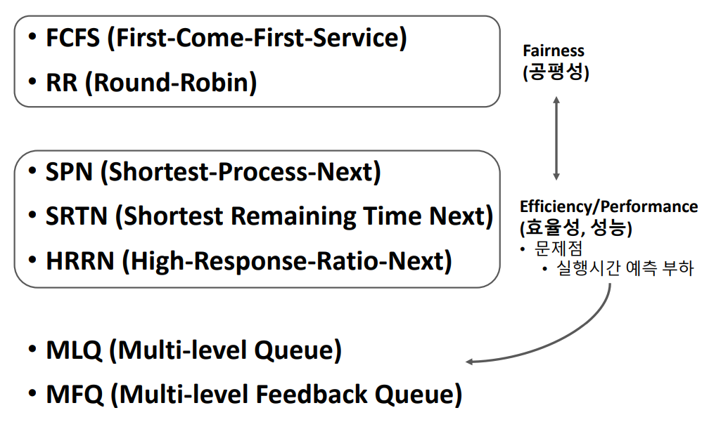

# [OS] Lecture 5-2. Basic Scheduling Algorithm

## 1. FCFS (First-Come-First-Service)

- Non-Preemptive Scheduling
- 스케줄링 기준(Criteria)
  - **도착시간** (ready queue 기준)
  - 먼저 도착한 프로세스를 먼저 처리
- 자원을 효율적으로 사용 가능
  - High resource utilization 
  - Scheduling Overhead가 적다
  - processor가 쉬지않고 일함!
- Batch system에 적합, interactive system에 부적합
- 단점
  - **Convoy effect**
    - 하나의 수행시간이 긴 프로세스에 의해 다른 프로세스들이 긴 대기시간을 갖게 되는 현상 (대기시간 >> 실행시간)
  - 긴 평균 응답 시간 (response time)

### 예제.

- Normalized TT (정규화된 TT)
  - 상대적으로 얼마나 더 기다렸나? (체감 대기시간 느낌)

## 2. Round-Robin

- Preemptive Scheduling
- 스케줄링 기준 
  - **도착 시간 (ready queue 기준)**
  - 먼저 도착한 프로세스를 먼저 처리
- **`자원 사용 제한 시간(time quantum, δ)`이 있다.**
  - System parameter
  - 프로세스는 할당된 시간이 지나면 자원 반납
    - Timer-runout
  - 특정 프로세스의 자원 독점(monopoly) 방지
  - Context switch overhead가 크다
- 대화형, 시분할 시스템에 적합
- **`Time Quantum(δ)`이 시스템 성능을 결정하는 핵심요소**
  - Very large (infinite)  δ -> FCFS
  - Very small δ- > Processor sharing
    - 사용자는 모든 프로세스가 각각의 프로세서 위에서 실행되는 것처럼 느낌
      - 체감 프로세서 속도 = 실제 프로세서 성능의 1/n
    - High context switch overhead

### 예제.

## 3.  SPN (Shortest -Process -Next)

- non-preemptive Scheduling
- 스케줄링 기준
  - **실행시간 (Burst Time 기준)**
  - Burst time 가장 작은 프로세스를 먼저 처리
    - **SJF(Shortest Job First) Scheduling**

- **장점**
  - 평균 대기시간(WT) 최소화
  - 시스템 내 프로세스 수 최소화
    - 스케줄링 부하 감소, 메모리 절약 -> 시스템 효율 향상
  - 많은 프로세스들에게 빠른 응답 시간 제공
- **단점**
  - **Starvation (무한 대기 현상) 발생**
    - BT가 긴 프로세스는 자원을 할당 받지 못할 수 있음
      - Aging 등으로 해결 (e.g. HRRN)
  - 정확한 실행시간을 알 수 없음
    - 실행시간 예측 기법이 필요

### 예제.

## 4. SRTN (Shortest-Remaining-Time-Next)

- SPN의 변형
- Preemptive Scheduling
  - 잔여실행시간이 더 적은 프로세스가 ready 상태가 되면 선점됨
- 장점
  - SPN 장점 극대화
- 단점
  - 프로세스 생성 시, 총 실행시간 예측이 필요함
  - 잔여 실행을 계속 추적해야 함 -> Overhead
  - context Switching Overhead

### 예제.

## 5.HRRN (High-Response-Ratio-Next)

- SPN의 변형
  - SPN + `Aging concepts`
  - `Aging Concepts`
    - 프로세스의 대기시간(WT)를 고려하여 기회를 제공
- Non-preemptive Scheduling
- 스케줄링 기준
  - `Response ratio`가 높은 프로세스 우선
  - `Response ratio`
    - `WT + BT`/ `BT` (응답률)
    - SPN의 장점 + `Starvation` 방지
    - 실행 시간 예측 기법 필요(Overhead)

### 예제.

## 6. MLQ(Multi-level Queue)

- 작업 (or 우선순위)별 별도의 ready Queue를 가짐 (여러개의 Queue를 갖는다.)
  - 최초 배정된 queue를 벗어나지 못함
  - 각각의 queue는 자신만의 스케줄링 기법 사용
- Queue 사이에는 우선순위 기반의 스케줄링 사용
  - E.g, Fixed-Priority Preemptive Schedling
- 장점
  - 빠른 응답시간(?) - > 우선순위에 따라 다르다
- 단점
  - 여러 개의 `Queue 관리` 등 스케줄링 overhead
  - 우선순위가 낮은 queue는 `starvation 현상` 발생 가능

## 7. MFQ (Multi-Level Feedback Queue)

- 프로세스의 Queue간 이동이 허용된 MLQ
- Feedback을 통해 우선 순위 조정
  - **우선순위가 동적이다!!!!!**
  - 현재까지의 프로세서 사용 정보(패턴) 활용
- 특성
  - Dynamic priorty
  - Preemptive scheduling
  - Favor short burst-time processes
  - Favor I/O bounded processes
  - Improve adaptability
- 프로세스에 대한 사전 정보 없이**(BT 예측 없이!**) SPN, SRTN, HRRN 기법의 효과를 볼 수 있음

- **단점**

  - 설계 및 구현이 복잡, 스케줄링 overhead가 크다
  - Starvation 문제 등

- **변형**

  - 각 준비 큐마다 시간 할당량을 다르게 배정
    - 프로세스의 특성에 맞는 형태로 시스템 운영
  - **입출력 위주 프로세스**(`I/O bounded`)들을 상위 단계의 큐로 이동, 우선순위 높임
    - `I/O bounded`는 프로세스를 금방 쓰고 빠짐!! -> 부하를 줄일 수 있다.
    - 프로세스가 block 될 때, 상위 준비 큐로 진입하게 함
    - 시스템 전체의 평균 응답 시간을 줄임, 입출력 작업 분산 시킴

  - 대기 시간이 지정된 시간을 초과한 프로세스 들을 상위 큐로 이동
    - `Aging 기법`

- Parameters for MFQ scheduling
  - Queue의 수
  - Queue별 스케줄링 알고리즘
  - 우선 순위 조정 기준
  - 최초 Queue 배정방식 등...

## 8. Basic Scheduling Algorithm 요약

###### 	*이  [강의](https://www.youtube.com/playlist?list=PLBrGAFAIyf5rby7QylRc6JxU5lzQ9c4tN)를 통해 공부하고 배운 내용을 정리하였습니다.