# [OS] Lecture 6. Process Synchronization and Mutual Exclusion

## 1. `동기화(Process Synchronization)`란?

> `다중 프로그래밍 시스템` 에는 여러 개의 프로세스가 존재. 이 때 프로세스 들은 독립적으로 동작하기 때문에 `공유자원` 혹은 `데이터`가 있을 때, 문제가 발생할 수 있다.
>
> **즉,  `동기화(Synchronizaion)`을 통해 프로세스 들이 서로 동작을 맞추고, 정보를 공유하게 된다!**

- 비동기적(Asynchronous)

  - 프로세스들이 서로에 대해 모름

- 병행적(Concurrent)

  - 여러개의 프로세스들이 동시에 시스템에 존재

  -> `병행` 수행중인 `비동기적 프로세스`들이 공유 자원에 동시에 접근 할 때, 문제 발생 가능!!

### 용어 정리

- `Shared data(공유 데이터)` or `Critical data`
  - 여러 프로세스들이 공유하는 데이터
- `Critical section(임계 영역, CS)`
  - 공유 데이터를 접근하는 코드 영역(Code Segment)
- `Mutual exclusion(상호배제)`
  - 둘 이상의 프로세스가 동시에 `Critical Section`에 진입하는 것을 막는 것

### 기계어(Machine instruction)의 특성

- Atomicity(원자성)
- Indivisible(분리 불가능)
- **한 기계어 명령의 실행 도중에 인터럽트 받지 않음**

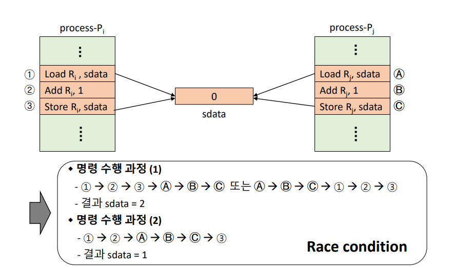

- `Race Condition`
  - 수행 순서에 따라 결과가 달라질 수 있는 경우
  - 이러면 안돼!!!

## 2. Mutual Exclusion(상호배제)

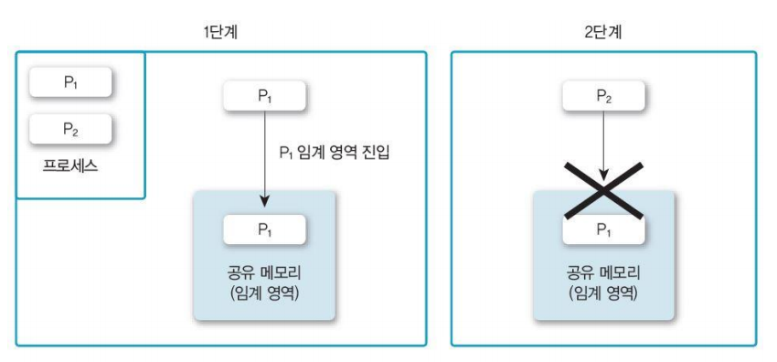

- 누군가 Critical Section에 있다면 다른 친구가 진입 금지!!!

### 2-1. Mutual Exclusion Methods

- `Mutual Exclusion primitives`       *`Primitive` : 기본연산 정도로 해석하면 된다.
  - enterCS() primitive
    - Critical Section 진입 전 검사
    - 다른 프로세스가 Critical section 안에 있는지 검사
  - exitCS() primitive
    - Critical setcion을 벗어날 때의 후처리 과정
    - Critical section을 벗어남을 시스템이 알림
- `Requirements for ME primitives`
  - **Mutual exclusion (상호 배제)**
    - Critical Section(CS) 에 프로세스가 있으면, 다른 프로세스의 진입을 금지
  - **Progress (진행)**
    - CS 안에 있는 프로세스 외에는, 다른 프로세스가 CS에 진입하는 것을 방해하면 안됨.
  - **Bounded waiting (한정 대기)**
    - 프로세스의 CS 진입은 유한시간 내의 허용되어야 함

​	

### 상태 1

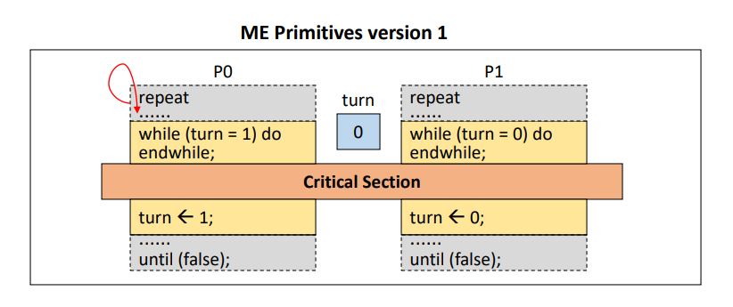

-  **`Progress (진행)` 조건 위배**
  - 한 프로세스가 죽었거나, 다른 프로세스가 먼저 준비가 됐을 때, 들어갈 수 없다

### 상태 2

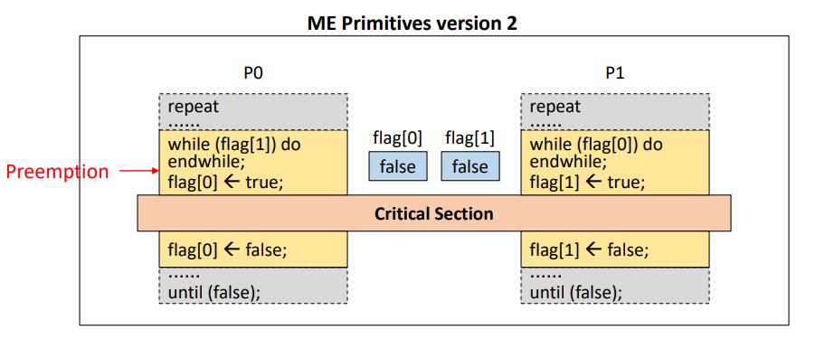

- **`Mutual exclusion` 조건 위배**
  - 중간에 `Preemption`된다면 CS안에 둘이 들어가는 상황 발생 가능

### 상태 3

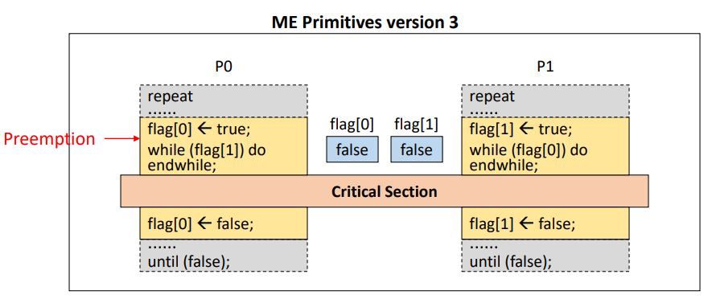

- **`Progress`, `Bounded waiting` 조건 위배**
  - 중간에 `Preemption` 됐을 때, 둘다 `while`문에서 대기하는 상황이 발생할 수 있음

## 3. Mutual Exclusion Solution

- SW solutions
  - Dekker's algorithm (Peterson's algorithm)
  - Dijstra's algorithm, Knuth's algorithm, Eisenberg and McGuire's algorithm, Lamport's algorithm
- HW solutions
  - TestAndSet(TAS) instruction
- OS supported SW solution
  - Spinlock
  - Semaphore
  - Eventcount/sequencer
- Language-Level solution
  - Monitor

## 4. SW Solutions

### 4-1. Dekker's Algorithm

- Two Process ME을 보장하는 최초의 알고리즘
- 위의 Version1과 Version3를 합친 형태

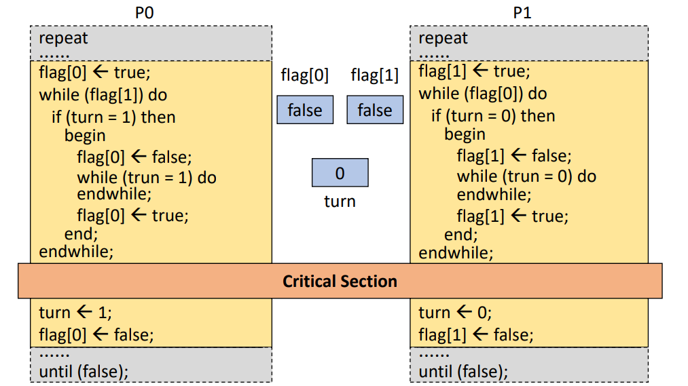

### 4-2. Peterson's Algorithm

- `Dekker's Algorithm`보다 간결하게 구현

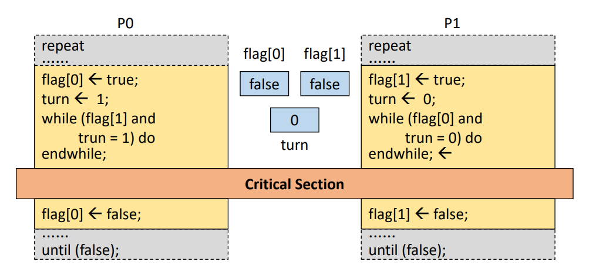

### 4-3. Dijkstra's Algorithm(다익스트라 알고리즘)

- 최초로 프로세스 `n개의 상호배제 문제(N-Process Mutual exclusion)`를 소프트웨어적으로 해결

- 실행시간이 가장 짧은 프로세스에 프로세서를 할당하는 세마포 방법, 가장 짧은 평균 대기시간 제공
- `Flag`의  state를 3개로 분류!

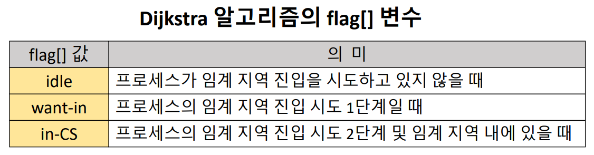

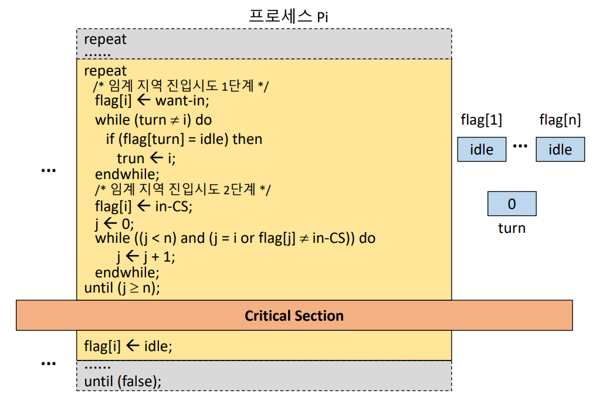

### 4-4. 기타 SW 알고리즘

- 크누스(Knuth)
  - 이전 알고리즘 관계 분석 후 일치하는 패턴을 찾아 패턴의 반복을 줄여서 프로세스에 프로세서 할당
  - 무한정 연기할 가능성을 배제하는 해결책을 제시했으나, 프로세스들이 아주 오래 기다려야함
- 램포트(Lamport)
  - 사람들로 붐비는 빵집에서 번호표를 뽑아 빵 사려고 기다리는 사람들에 비유해서 만든 알고리즘(Bakery Algorithm)
  - 준비 상태 큐에서 기다리는 프로세스마다 우선순위를 부여하여 그 중 우선순위가 가장 높은 프로세스에 먼저 프로세서를 할당함
- 핸슨(Brinch Hansen)
  - 실행시간이 긴 프로세스에 불리한 부분을 보완하는 것
  - 대기시간과 실행 시간을 이용하는 모니터 방법
  - 분산처리 프로세서 간의 병행성 제어 많이 발표

### 4-5. SW solution의 문제점

- 속도가 느리다
- 구현이 복잡하다
- ME primitive 실행 중, preemption 될 수 있음
  - 공유 데어터 수정 중인 interrupt를 억제 함으로서 해결 가능
    - Overhead 발생
- `Busy Waiting`
  - 기다리는 와중에도 계속 로직이 돌아가고 있음
  - inefficient

## 5. HW Solutions

- Synchronization Hardware
- TestAndSet(TAS) instruction
  - Test와 Set을 한번에 수행하는 기계어
  - Machine instruction
    - Atomicity, Indicisible
    - 실행 중 Interrupt를 받지 않음 (`Preemption` 되지 않음)
- 장점
  - 구현이 간단
- 단점
  - `Busy Waiting`
    - 위 문제를 해소한 상호 배제 기법!!
    - `Semaphore` : 대부분의 OS들이 사용하는 기법!!

### TestAndSet 명령어

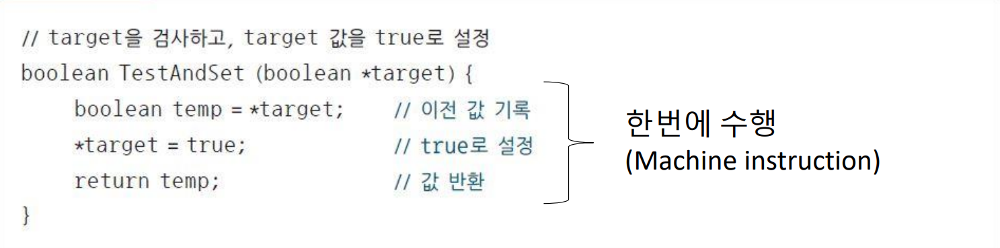

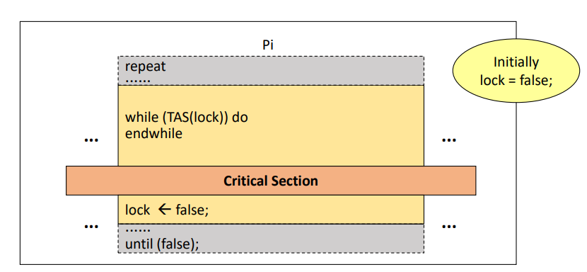

- **But!!! 3개 이상의 프로세스라면 `Bounded waiting` 조건 위배**
  - 로직이 돌아가는 순서에 따라서, 계속 못들어갈수도 있음 ㅠ.ㅠ

### N-Process Mutual exclusion

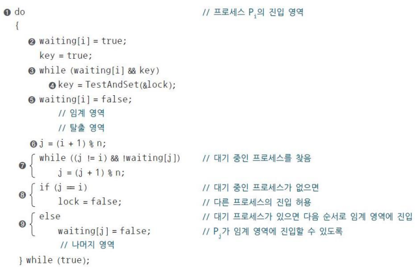

- 대기중인 애들 중에서 가장 가까운 애를 불러오는 형태(8번)

  

## 6. Spinlock

- 정수형 변수 S
- 초기화, P(), V() 연산으로만 접근 가능
  - 위 연산들은 모두 `atomic`한 연산
    - `OS support` : OS가 모두 진행됨을 보장해줌(`Preemption`되지 않음)
    - 전체가 한 instruction cycle에 수행됨
  -  `P(S)`
    - S는 물건의 갯수
    - 물건을 꺼내가는 개념
    - S <- S-1
  - `V(S)`
    - 물건을 집어넣는 개념
    - S <- S+1

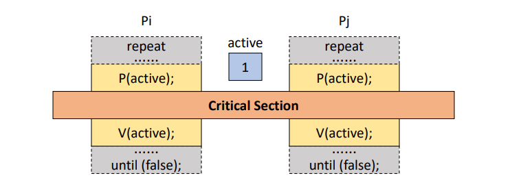

- 멀티 프로세서 시스템에서만 사용 가능하다.
  - `CPU`가 2개 이상 존재해야 한다,(2개 이상의 프로세스가 작동할 수 있어야 한다.)
- `Busy waiting`

## 7. Semaphore

- 1965년 Dijkstra가 제안
- `Busy waiting`문제 해결
- 음이 아닌 정수형 변수(S)
  - 초기화, S(), V()로만 접근 가능
    - `S()` : Probern(검사)
    - `V()`: Verhogen(증가)
- 임이의 S 변수 하나에 `ready queue` 하나가 할당되는 형식
- No busy waiting
  - 기다려야 하는 프로세스는 block(asleep) 상태가 됨
- wake-up 순서는 비 결정적
  - `Starvation` 발생 가능 ㅠ.ㅠ

### Binary semaphore

- S가 0과 1 두종류의 값만 갖는 경우
- 상호배제나 프로세스 동기화의 목적으로 사용

### Counting semaphore

- S가 0 이상의 정수값을 가질 수 있는 경우
- Producer-Consumer 문제 등을 해결하기 위해 사용

### P()연관과 V()연산

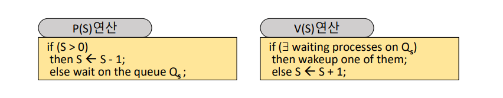

- `else wait on the queue Qs` : S가 없다면!! Queue(대기실, `ready queue`)에서 기다린다!!!
- v() : `ready queue`에  누구 있으면 깨워줘~ 아니면 그냥 S에 하나 추가
- 모두 `indivible`연산
  - OS support

### Semaphore로 해결 가능한 동기화 문제들

- #### 상호배제 문제 (Mutual exclusion)

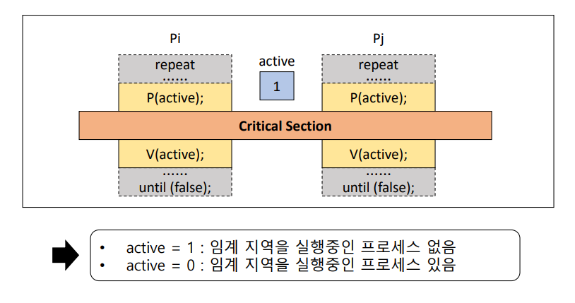

#### 프로세스 동기화 문제 (Process synchronization problem)

- Process들의 실행 순서 맞추기
  - 프로세스들은 병행적이며, 비동기적으로 수행

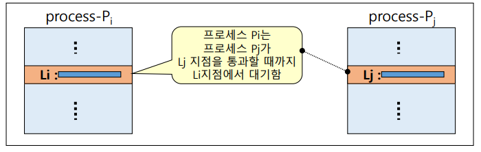

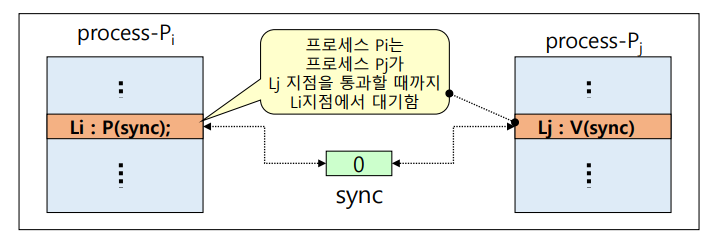

#### 생산자 소비자 문제 (Producer-Cusumer Problem)

- 생산자(Producer) 프로세스
  - 메세지를 생성하는 프로세스 그룹
- 소비자(Consumer) 프로세스
  - 메세지를 전달받는 프로세스 그룹

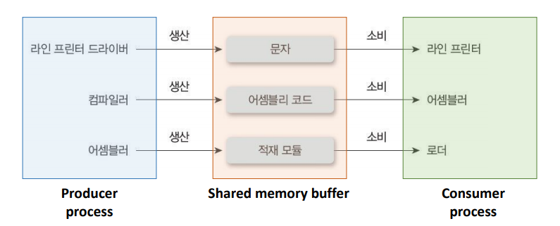

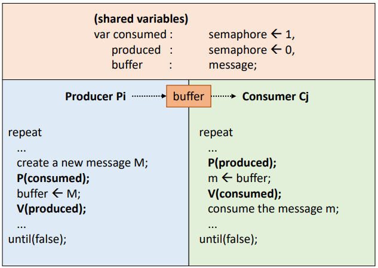

		- 생산과 소비 여부를 확인하는 `Consumed`와 `produced`가 존재	
	
		- 여부가 확인되면 buffer에 메세지를 넣고 뺀다.

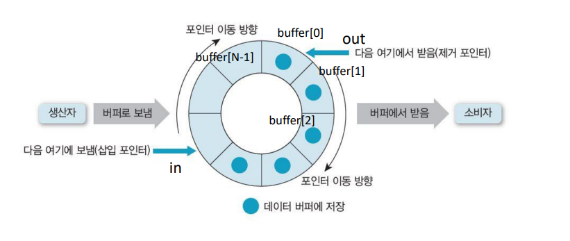

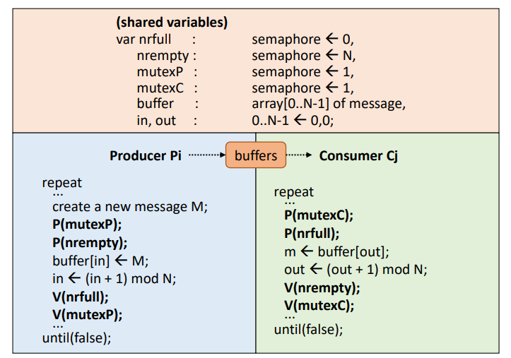

- Buffer 크기가 N인 경우
  - `mutexP`, `mutexC` : 한번의 한명의 생산자, 소비자만 작동하게끔 도와줌
    - 그 내부는 `CS`라 판단
    - 상호배제(mutual exclusion) 역할
  - `nufull` : 채워진 buffer의 수
    - 빈공간이 있으면 생산자 작동
  - `nrempty` : 빈 buffer의 수
    - 물건이 있으면 소비자 작동

#### Reader-Writer 문제

- Reader
  - 데이터에 대해 읽기 연산만 수행
  - 여러명이 읽어도 상관 없음
  - 쓰는 사람이 있을 땐, 읽을 수 없다
- Writer
  - 데이터에 대해 갱신 연산을 수행
  - 한명만 써야된다.
  - 읽는 사람이 있을 땐, 쓸수 없다

- 데이터 무결성 보장 필요
  - Reader들은 동시에 데이터 접근 가능
  - Writer들(or  reader와 writer)이 동시에 접근 시 상호배제(동기화) 필요
- 해결법
  - 우선권 부여
  - Reader preference solution
  - Writer preference solution

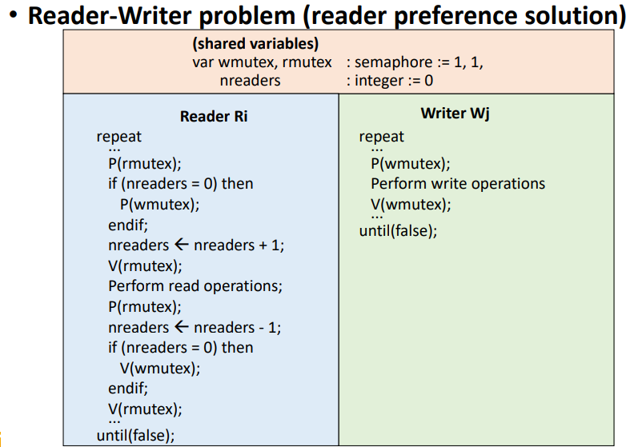

## 8. Eventcount/Sequencer

- `Semapore`에서 무작위로 wake-up 하는 것을 개선한 것
- No busy waiting
- NO Starvation
  - FIFO scheduling for Qe
- `Semaphore`보다 더 low-level control(세부적인 control)이 가능하다

- `Sequencer`

  - 정수형 변수
  - 생성시 0으로 초기화, 감소하지 않음
  - 발생 사건들의 순서 유지
  - `ticket()` 연산으로만 접근 가능

- `ticket(S)`

  - 현재까지 ticket()ㅎ연산이 호출 된 횟수를 반환
  - indivisible operation

- `Eventcount`

  - 정수형 변수
  - 생성시 0으로 초기화, 감소하지 않음
  - 특정 사건의 발생 횟수를 기록
  - `read(E)`, `advance(E)`, `await(E,v)` 연산으로만 접근 가능

- `read(E)`

  - 현재 Eventcount 값 반환

- `advance(E)`

  - E += 1
  - E를 기다리고 있는 프로세스를 깨움(wake-up)

- `await(E,v)`

  - V는 정수형 변수

  - if (E < v)이면 E에 연결된 QE에 프로세스 전달(push) 및 CPU scheduler 호출

### Mutual exclusion

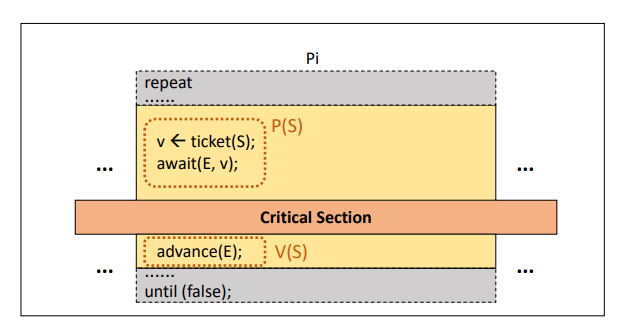

### Producer-Consumer problem

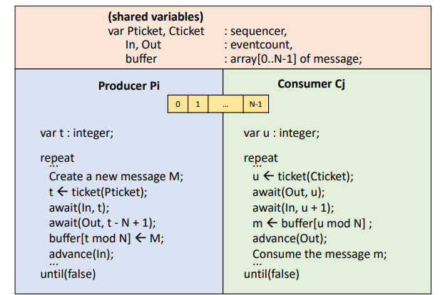

## 9. Language-Level solution - Monitor 도저히 모르게쒀요 ㅠㅠㅠㅠㅠㅠ

- High-level Mechanism의 특징
  - language-level constructs
  - Object Oriented concept과 유사
  - 사용이 쉬움

### 1. Monitor

- 공유 데이터와 Critical section의 집합
- Conditional variable
  - `wait()`, `signal()` operations

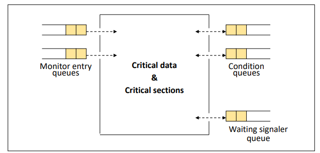

### 2. Monitor의 구조

- **Entry queue(진입 큐)**

  - 모니터 내의 procedure 수만큼 존재

- **Mutual exclusion**

  - 모니터 내에는 항상 하나의 프로세스만 진입 가능

- **Information hiding (정보 은폐)**

  - 공유 데이터는 모니터 내의 프로세스만 접근 가능

- **Condition queue (조건 큐)**

  - 모니터 내의 특정 이벤트를 기다리는 프로세스가 대기

- **Signaler queue (신호 제공자 큐)**

  - 모니터에 항상 하나의 신호제공자 큐가 존재
  - signal() 명령을 실행한 프로세스가 임시 대기

  

### Monitor 자원 할당 문제

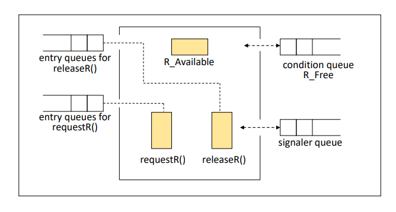

###### 	*이  [강의](https://www.youtube.com/playlist?list=PLBrGAFAIyf5rby7QylRc6JxU5lzQ9c4tN)를 통해 공부하고 배운 내용을 정리하였습니다.