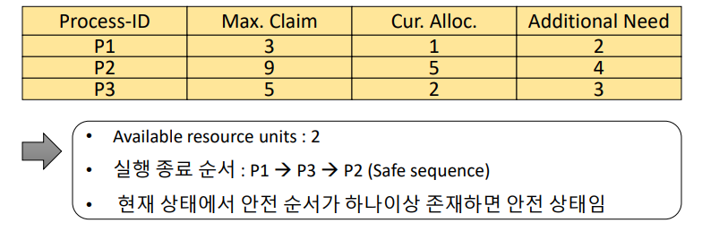
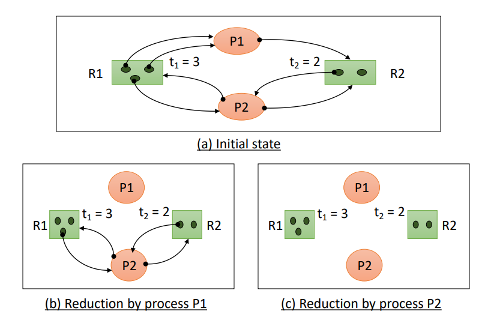

# [OS] Lecture 7. Deadlock and Resourse types

## 1. `Deadlock`이란?

- Blocked/Asleep state

  - 프로세스가 `특정 이벤트`나 `자원`을 기다리는 상태

- Deadlock state

  - 프로세스가 **발생 가능성이 없는 이벤트**를 기다리는 경우
  - **프로세스**가 `deadlock` 상태에 있다.
  - 시스템 내에 deadlock에 빠진 프로세스가 있는경우
    - **시스템**이 `deadlock` 상태에 있다.
  

## 2. 자원의 분류

- **H/W resoursevs S/W resource**

- **선점 가능여부**
  - `Preemptible resources`
    - 선점 당한 후, 돌아와도 문제가 발생하지 않는 자원
    - Processor, memory 등
  - `Non-Preemptible resources`
    - 선점 당하면, 이후 진행에 문제 발생
      - `Rollback`, `restart` 등 특별한 동작이 필요
    - disk drive 등
- **할당 단위에 따른 분류**
  - `Total allocation resources`
    - 자원 전체를 프로세스에 할당
    - Processor, disk drive 등
  - `Partitioned allocation resources`
    - 하나의 자원을 여러 조각으로 나누어 여러 프로세스들에게 할당
    - Memory 등
- **동시 사용가능 여부**
  - `Exclusive allocation resources`
    - 한순간에 한 프로세스만 사용 가능한 자원
    - processor, memory, disk drive 등
  - `shared allocation resources`
    - 여러 프로세스가 동시에 사용 가능한 자원
    - Program(SW), shared data 등
- **재사용 가능 여부**
  - `SR(serially-Reusable Rsources)`
    - 시스템 내에 항상 존재하는 자원
    - 사용이 끝나면, 다른 프로세스가 사용 가능
    - Processor, memory, dick drive, program 등
  - `CR (Consumable Resources)`
    - 한 프로세스가 사용한 후에 사라지는 자원
    - Signal, message 등

### Deaklock을 발생 시킬 수 있는 자원의 종류?!

- Non-Preemptible resources
- Exclusive allocation resources
- Serially reusable resources
- Consumable resource도 발생 가능하지만 고려하기엔 너무 복잡해짐!
- 할당단위는 영향 X

## 3. Deadlock Model 표현법

### 1. Graph Model

- Node
  - 프로세스 노느(P1, P2), 자원 노드(R1, R2)
- Edge
  - Rj->Pi : 자원 Rj이 프로세스 Pi에 할당됨
  - Pi->Rj : 프로세스 Pi가 자원 Rj를 요청 (대기 중)

- **2개의 프로세스(P1, P2)와 2개의 자원(R1,R2) 일때, 다음과 같은 상황 발생 시 deadlock발생**

### 2. State Transition Model

- 2개의 프로세스와 A type의 자원 2개(unit) 존재
- 프로세스는 한번에 자원 하나만 요청/반납 가능

## 4. Deadlock 발생 필요 조건

- **`자원의 특성` +  `프로세스의 특성` 두개의 환상의 콜라보!**
  - 아래 4개중 하나만 방지해도 발생 X 

- 자원의 특성
  - Exclusion use of resources
  - Non-Preemptible resources
- 프로세스의 특성
  - Hold and wait(Partial allocation)
    - 자원을 하나 hold하고 다른 자원 요청
  - Circular wait

## 5. Deadlock 해결 방법

### 5-1. Deadlock Prevention

- 4개의 deadlock 발생 필요 조건 중 하나를 제거
- Deadlock이 절대 발생하지 않음
  - But! 심각한 자원낭비 발생 -> 비현실적
- **Exclusion use of resources 조건 제거**
  - 모든 자원을 공유 허용
  - 이는 현실적으로 불가능
- **Non-Preemptible resources 조건 제거**
  - 모든 자원에 대해 선점 허용
  - 현실적으로 불가능
  - 유사한 방법
    - 프로세스가 할당 받을 수 없는 자원을 요청한 경우, 기존에 가지고 있던 자원을 모두 반납하고 작업 취소
      - 이후 처음부터 다시 시작
    - 심각한 자원 낭비 발생 -> 비현실적
- **Hold and wait(Partial allocation) 조건 제거**
  - 필요한 자원을 한 번에 모두 할당(Total allocation)
  - 자원 낭비 발생
    - 필요하지 않은 순간에도 가지고 있음
  - 무한 대기 현상 발생 가능(Starvation)
- **Circular wait 조건 제거**
  - Totally allocation을 일반화 한 방법
  - 자원들에게 순서를 부여
  - 프로세스는 순서의 증가 방향으로만 자원 요청 가능
  - 자원 낭비 발생

### 5-2. Deadlock Avoidance method

- 교착상태 회피

- 시스템의 상태를 계속 감시하다가! deadlock 가능성이 있는 자원 할당 요청 보류
  - High Overhead(계속 감시해야되서 ㅠ,ㅠ)
- 시스템을 항상 `safe state`로 유지
  - `Safe state`
    - 모든 프로세스가 정상적으로 종료 가능한 상태
    - `Safe sequence`가 존재
      - Deadlock 상태가 되지 않을 수 있음을 보장
  - `Unsafe state`
    - Deadlock이 될 가능성이 있음. But 반드시 발생은 아님!
- Low resource utilization
  - safe state유지를 위해, 사용되지 않는 자원 존재
- Not practical
  - 필요한 최대 자원수를 알고 있다 가정 후 진행되기 때문에 ㅠㅠ
- 가정 (사실 상 비현실적/ 실용적 X)
  - 프로세스 수가 고정됨
  - 자원의 종류와 수가 고정점
  - 프로세스가 요구하는 자원 및 최대 수량을 알고 있음
  - 프로세스는 자원을 사용 후 반드시 반납한다.

### Dijkstra's Banker's  algorithm

- Deadlock avoidance를 위한 간단한 이론적 기법
- 한종류의 자원이 여러개라 가정
- 시스템을 항상 safe state로 유지
- 10개의 resource, 3개의 process일 때,
  - 다음과 같이 안전하게 진행될 sequence가 존재 -> safe State

- 아래와 같은 경우는 deadlock 가능성 존재

### Habermann's algorithm

- Djikstra's algorithm의 확장
- 여러종류의 자원을 고려
- 시스템을 항상 safe state로 유지
- 5개의 프로세스, 3개의 자원(Ra, Rb, Rc)와 각각 (10, 5, 7)개가 존재한다고 가정

### 5-3. Deadlock detection and deadlock recovery methods

### Deadlock detection

- Deadlock 방지를 위한 사전 작업을 하지 않음

  - Deadlock 발생 가능

- 주기적으로 deadlock 발생 확인

  - 어떤 시스템/프로세스가 deadlock인가 확인

- `Resource Allocation Graph (RAG)` 사용

  - Deadlock 검출을 위해 사용
  - Directed(방향성), bipartite(파트가 양분된 형태) Graph 

  ​			

  

  - Directed Graph G = (N,E)
    - N = {Np, Nr} 
      - Np : 프로세스 노드의 집합
      - Nr : 리소스 노드의 집합
  - Edge는 Np와 Nr 사이에만 존재
    - e = (Pi, Rj) : 자원 요청
    - e = (Rj, Pi) : 자원 할당

  

  - Rk : k type의 자원
  - Tk : Rk의 단위 자원 수
  - |(a,b)| : (a,b) edge 의 수

  

  

### Graph reduction - Deadlock detection method

- 주어진 RAG에서 Edge를 하나씩 지워가는 방법

- High overhead

  - 검사 주기에 영향을 받음
  - Node가 많으면 과부하

- `Completely reduced`

  - 모든 edge가 제거됨
  - Deadlock에 빠진 프로세스가 없음

- `Irreducible`

  - 지울 수 없는 edge가 존재
  - 하나 이상의 프로세스가 deadlock상태

- `Unblocked process`

  - 필요한 자원을 모두 할당 받을 수 있는 프로세스
  - 모든 j에 대해서, (Pi가 요청하는 모든 자원에 대해서, `요청수` <=`모든 Rj` - `Rj가 할당된 자원j의 수(할당된 Rj의 수)` == `남은 수`
  - 요청 수 <= 남은 수

  

  

  

- Graph reduction procedure

  - Unblocked process에 연결된 모든 edge를 제거
  - 더이상 Unblocked process가 없을 때까지 반복

  - 최종 Graph에서
    - 모든 edge 제거 -> Completely reduced
    - 일부 남아있음 -> Irreducible
      - 자원 할당을 받을 수 없는 프로세스가 존재

### 예제 1

### 예제 2

### Deadlock Recovery

- Deadlock 검출 후 해결하는 과정
- `Process termination`
  - Deadlock 상태의 프로세스를 종료
  - 강제 종료 후, 재시작
  - `Termination cost model`
    - 강제 종료시킬 프로세스 선택 기준
    - `Lowest-termination cost process first`
      - Simple, Low overhead(O(n))
      - 불필요한 프로세스가 종료될 가능성이 높다
    - `Mininum cost recovery`
      - 최소비용으로 Deadlock을 해결할 수 있는 프로세스 종료
      - Complex, High overhead(O(2^n))
    - Termination cost
      - 우선순위, 종류, 총 수행시간, 남은 수행시간, 종료 비용 등
- `Resource Preemption`
  - Deadlock 해결을 위해 선점할 자원 선택
  - 다른 프로세스에서 해당 재원을 뺏어옴
    - 뺏긴 프로세스는 강제종료 ㅠ.ㅠ
    - Deadlock 상태가 아닌 프로세스가 종료될 가능성도 있음
  - `Preemption cost model`
    - `Mininum cost recovery` : O(r)

### Checkpoint - restart method

- 프로세스의 수행 중 특정 지점(checkpoint) 마다 context를 저장
- Rollback을 위해 사용
  - 프로세스 강제 종료 후, 가장 최근 Checkpoint에서 재시작

###### 	*이  [강의](https://www.youtube.com/playlist?list=PLBrGAFAIyf5rby7QylRc6JxU5lzQ9c4tN)를 통해 공부하고 배운 내용을 정리하였습니다.