# [OS] Lecture 8. Main Memory management

## 1. 메모리의 종류

- 까먹었으면 [Overview](https://ashoil.tistory.com/26) 참고!

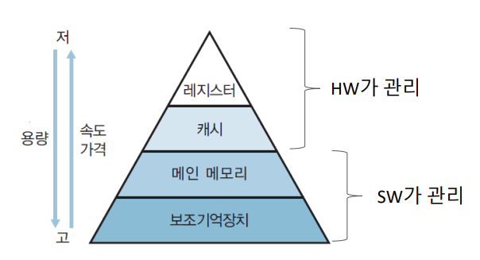

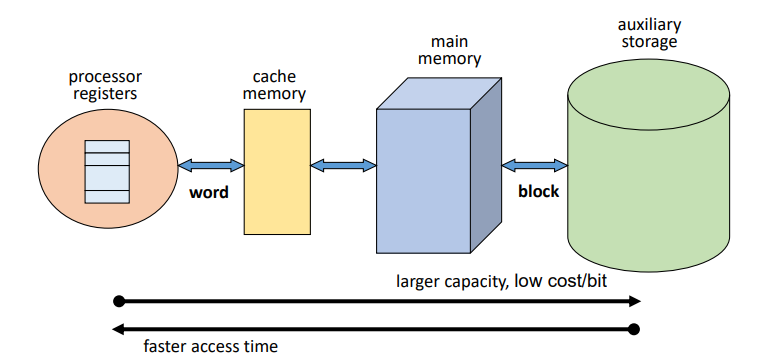

- Block
  - 주기억 장치와 보조기억 장치 사이에 데이터 전송 단위
  - size : 1~4KB
- Word
  - 주기억 장치와 레지스터 사이의 데이터 전송 단위
  - size: 16~64bits

## 2. Address binding

- 프로그램의 논리 주소를 실제 메모리의 물리 주소로 매핑(Mapping)하는 작업

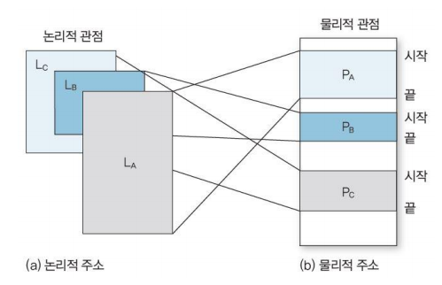

- binding 시점에 따른 분류

  - `Compile time binding`

    - 프로세스가 메모리에 적재될 **위치를 컴파일러가 알 수 있는 경우**
      - 위치가 변하지 않음
    - 프로그램 전체가 메모리에 올라가야 함

  - `Load time binding`

    - 메모리 적재 위치를 컴파일 시점에 모르면 **대체 가능한 상대 주소를 생성**
    - 적재 시점(Load time)에 시작 주소를 반영하여 사용자 코드 상의 주소를 재설정
    - 프로그램 전체가 메모리에 올라가야 함

    

  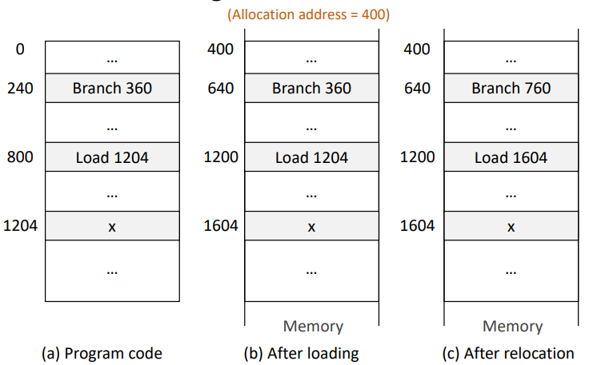

  

  

  - `Run time binding`
    
    - Address binding을 수행시간까지 연기
      - 프로세스가 수행 도중 다른 메모리 위치로 이동할 수 있음
    - HW의 도움이 필요하다
      - MMU : Memory Management Unit
    - 대부분 OS에서 사용되는 형태
    
    
    
    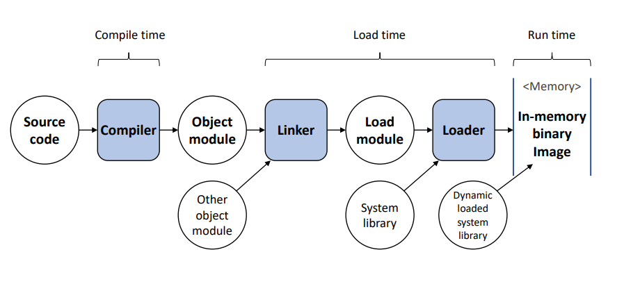
  
- `Dynamic Loading`
  
  - 모든 루틴(function)을 교체 가능한 형태로 디스크에 저장
  - 실제 호출 전까진 루틴을 적재하지 않음
    - 메인 프로그램만 메모리에 적재하여 수행
    - 루틴의 호출 시점에 Address binding 수행
  - 메모리 공간의 효율적 사용 가능
  
  

### 3. Swapping

>  프로세서 할당이 끝나고 수행 완료 된 프로세스는 swap-device로 보내고(`Swap-out`) 새롭게 시작하는 프로세스는 메모리에 적재(`Swap- in`)

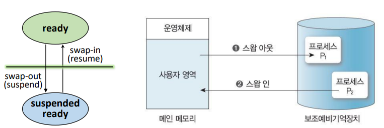

## 4. Memory Allocation - Continuos Memory Allocation

> 프로세스(context)를 하나의 연속된 메모리 공간에 할당하는 정책

- 메모리 구성 정책

  - 메모리에 동시에 올라갈 수 있는 프로세스 수 `Multiprogramming degree`
  - 각 프로세스에게 할당되는 메모리 공간 크기
  - 메모리 분할 방법

  

### Uni-programming 

- 하나의 프로세스만 메모리 상에 존재

  - Multiprogramming degree == 1

- 가장 간단한 메모리 관리 기법

- `프로그램의 크기 > 메모리 크기 ` 일 때, 문제 발생

  - Overlay structure
    - 메모리에 현재 필요한 영역만 적재
    - 사용자가 프로그램의 흐름 및 자료구조를 모두 알고 있어야함

  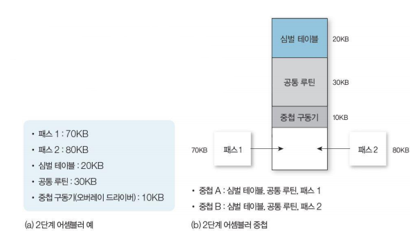

- `커널이 보호되지 않을 때`, 문제 발생
  
  - `경제 레지스터(Boundary register) `사용

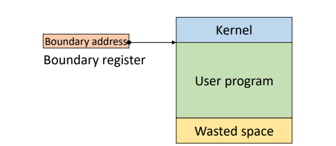

- `Low system resource uilization`, `Low system performance` : 낭비되는 공간이 너무 많다

### Fixed Partition Multi-Programming (FPM)

- 메모리 공간을 고정된 크기로 분할
  - 미리 분할 되어 있음
  - 메모리 관리가 간편함(Low overhead)
  - 시스템 자원이 낭비될 수 있음(`Fragmentaion`)
- 각 프로세스는 하나의 partition(분할)에 적재
  - Process : Partitioin = 1 : 1
- Partition의 수 = K
  - Multiprogramming degree == k

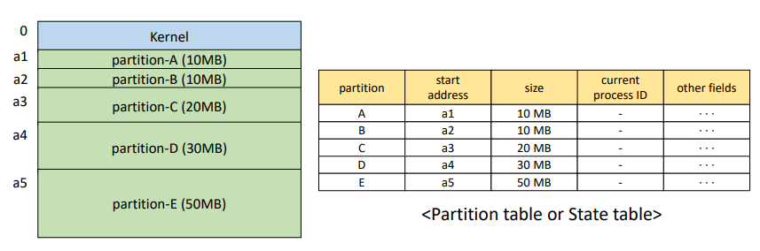

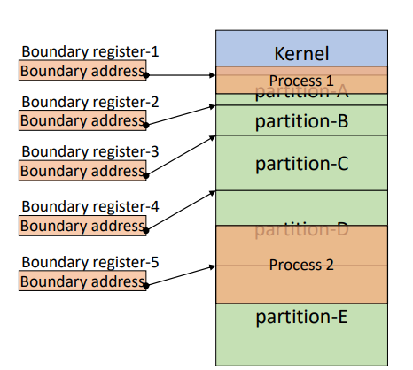

- `Fragmentation`
  - Internal Fragmentation
    - 내부 단편화
    - Partition크기 > Process 크기
      - 메모리가 낭비됨
  - External Fragmentaion
    - 외부 단편화
    - 남은 메모리 크기> Process 크기 BUT!! 연속된 공간이 아님
      - 메모리가 낭비됨

### Variable Partition Multi-programming(VPM)

- 초기에는 전체가 하나의 영억
- 프로세스를 처리하는 과정에서 메모리 공간이 동적으로 분할
  
  - No internal fragmentaion
- `배치전략 (Placement strategies)`
  
  - `First-fit (최초 적합)`
    - 충분한 크기를 가진 첫번째 Partition을 선택
    - Simple and low overhead
    - 공간 활용율이 떨어진다.
  - `Best-fit (최적 적합)`
    - Process가 들어갈 수 있는 partition중 가장 작은 곳 선택
    - 탐색 시간이 오래 걸림
    - 크기가 큰 partition을 유지할 수 있다.
    - 작은 크기의 partition이 많이 발생
      - 활용하기 너무 작다 ㅠ.ㅠ
  - `Worst-fit (최악 접합)` 
    - Process가 들어갈 수 있는 partition중 가장 큰 곳 선택
    - 탐색 시간이 오래 걸림
    - 작은 크기의 partition 발생을 줄일 수 있다
    - 큰 크기의 Partition확보가 어렵다.
  - `Next-fit (순차 최초 적합)`
    - `First-fit (최초 적합)`과 유사한 형태
    - state table에서 마지막으로 탐색한 위치부터 탐색
  - 메모리 영역의 사용 빈도를 균등화, Low overhead
  
  
  
- `Coalescing holes (공간 통합)`

  - `External Fragmentaion` 해결
  - 인접한 빈 영역을 하나의 Partition으로 통합
  - Process가 Memory를 release하고 나가면 수행
  - Low overhead

  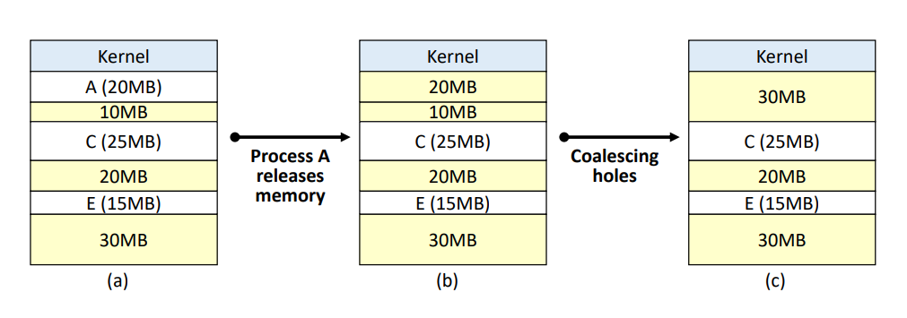

- `Starage Compation (메모리 압축)`
  
  - `External Fragmentaion` 해결
  - 모든 빈 공간을 하나로 통합
  - 프로세스 처리에 필요한 적재 공간 확보가 필요할 때 사용
  - High Overhead
    - 모든 Process 중지 및 재배치

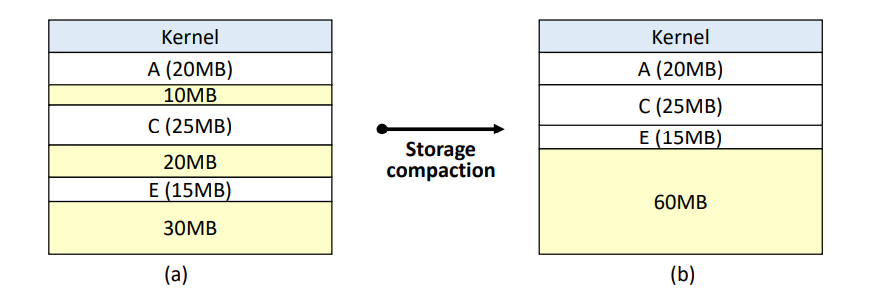

###### 	*이  [강의](https://www.youtube.com/playlist?list=PLBrGAFAIyf5rby7QylRc6JxU5lzQ9c4tN)를 통해 공부하고 배운 내용을 정리하였습니다.