# [OS] Lecture 9.  Virtual Memory

## 1. Non-Continuous allocation

- 사용자 프로그램을 여러 개의 block으로 분할
- 실행 시, 필요한 block들만 메모리에 적재
  - 나머지 block들은 swap device(disk라 생각)에 존재
- 기법들
  - paging system
  - Segmentation system
  - Hybrid paging/segmentaion system

## 2. Address Mapping

- Continuous allocation
  - Relative address (상대 주소)
    - 프로그램의 시작주소를 0으로 가정한 주소
  - Relocation (재배치)
    - 메모리 할당 후, 할당된 주소에 따라 상대주소들을 조정하는 과정
- Non-Continuous allocation
  - Virtual address (가상 주소) == relative address
    - Logical address (논리 주소)
    - 연속된 메모리 할당을 가정한 주소
  - Real address (실제 주소) == absolute (physical)
    - 실제 메모리에 적재된 주소
  - Address mapping
    - Virtual address -> real address

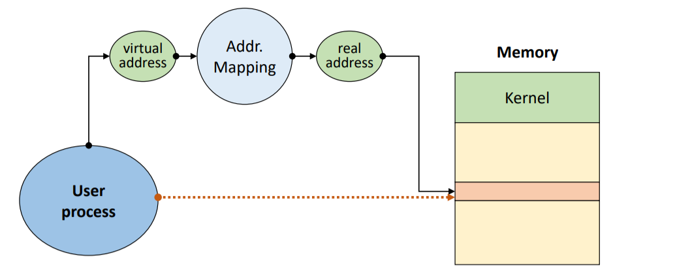

### Block Mapping

- 사용자 프로그램을 block 단위로 분할/관리
  - 각 block에 대한 address mapping 정보 유지
- Virtual address : v = (b,d)
  - b = Block number
  - d = displacement(offset) in a block

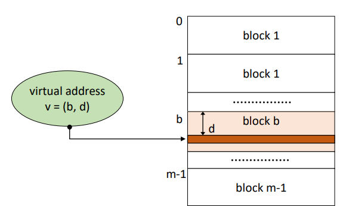

- Block Map Table (BMT)
  - Address mapping 정보 관리
    - Kernel 공간에 프로세스마다 하나의 BMT를 가짐
  - `Residence bit` : 해당 블록이 메모리에 적재 되었는지 여부(0/1)

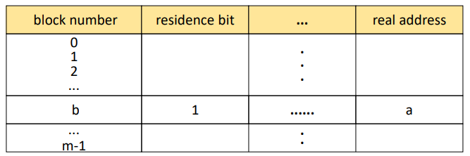

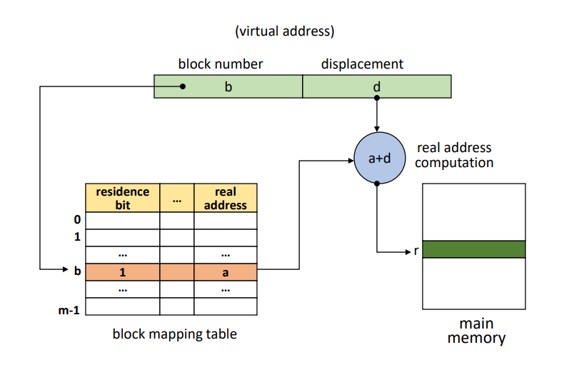

- `b` 블록이 적재 되었는지, 어디 있는지 BMT 참고

- `residence bit` 가 0이면 -> `swap device`에서 메모리 가져오고 업데이트

  `residence bit` 가 1이면 -> `real address` 가져오기

- 실제주소 r = real address + d
- r을 통해 메모리에 접근

## 3. Paging System

- 프로그램을 같은 크기의 블록으로 분할 (pages)
- Terminologies
  - Page
    - 프로그램의 분할된 block
  - Page frame
    - 메모리의 분할 영역
    - page와 같은 크기로 분할

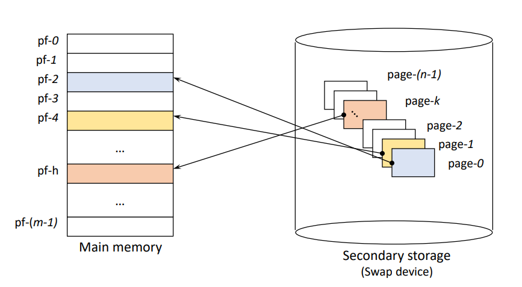

- 특징

  - 논리적 분할이 아님 (크기에 따라 분할)
    - Page 공유(Sharing) 및 보호(Protection) 과정이 복잡함
  - Simple and Efficient
  - No externel fragmentation
    - internal fragmentation은 가능 ㅠ.ㅠ -> 일정 크기로 나누다가 마지막 쪼가리

  

### Paging system - Address Mapping method

- Virtual address v = (p, d)
- Address Mapping
  - PMT(Page Map Table) 사용

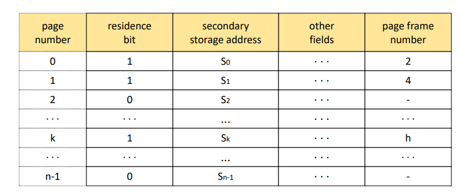

### Direct mapping (직접 사상)

- Block mapping과 유사
- 가정
  - PMT를 커널 안에 저장
  - PMT entry size = entry size (명명)
  - Page size = pageSize (명명)

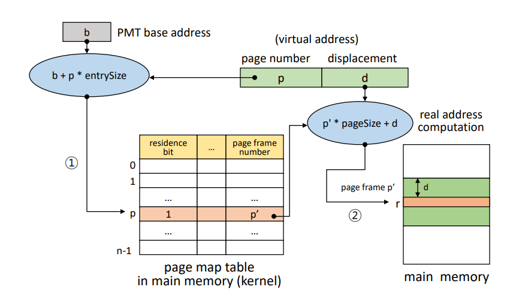

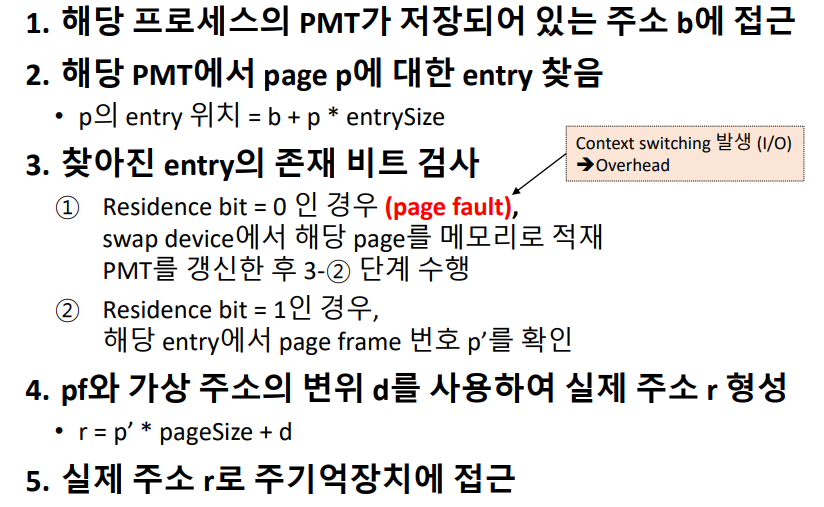

- `Page fault`

  - page fault가 발생하면 추가적인 I/O진행

    : `run` -> `asleep` -> `ready` -> `run` 과정이 진행됨

    : `Overhead` 

- 문제점

  - 메모리 접근 횟수가 2배 : 성능 저하 ㅠ.ㅠ (Performance degradation)
  - PMT를 위한 메모리 공간 필요

- 해결방안

  - Associative mapping (TLB)

  - PMT를 위한 전용 기억장치(공간) 사용

    - Dedicated register or cache memory

    

### Associative mappping (연관 사상)

- TLB (Translation Look-aside Buffer)에 PMT 적재
  - Associative high-speed memory
- PMT를 병렬 탐색
- Low overhead, high speed
- Expensive hardware 

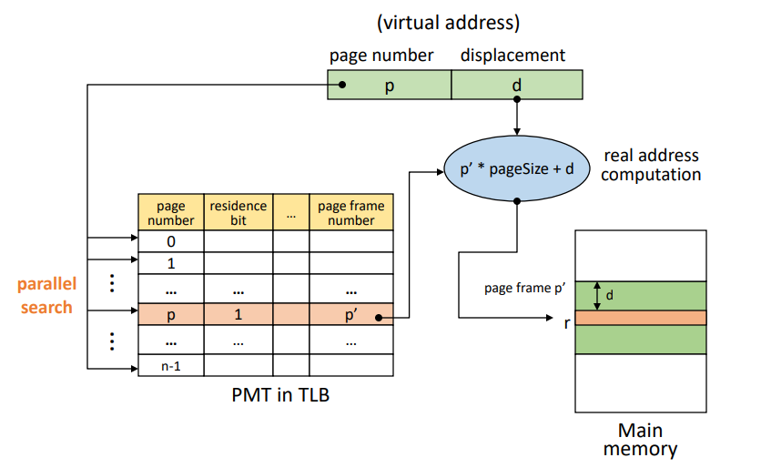

### Hybrid direct/associative mapping

- 두 기법을 혼합하여 사용
  - HW 비용은 줄이고, Associative 장점 활용
- 작은 크기의 TLB 사용
  - PMT : 메모리 (커널 공간)에 저장
  - TLB : PMT 중 일부 entry들을 적재
    - 최근 사용된 page들에 대한 entry 저장
  - Locality (지역성) 활용
    - 수행과정에서 한번 접근한 영역 주변을 다시 접근할 가능성이 높다.
    - 범인은 다시 현장에 나타난다.
- 프로세스의 PMT가 TLB에 적재되어 있는지 확인
  - 있으면, `Associative mapping` 활용
  - 없으면, `Paging mapping` 활용 후, 해당 entry `TLB에 적재`

### Paging system - Memory Management

- Page와 같은 크기로 미리 분할하여 관리/사용
  - Page frame
  - FPM 기법과 유사
- Frame table
  - Page frame 당 하나의 entry
  - 구성
    - Allocated/available field
    - PID field
    - Link field : For free list (사용가능 한 fp들을 연결)
    - AV : Free list header (free list의 시작점)

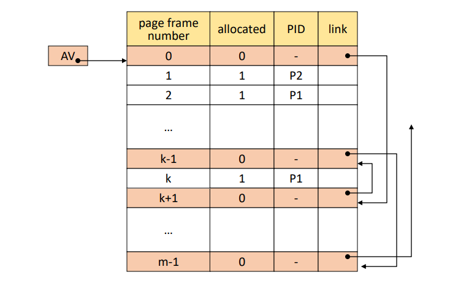

### Page Sharing

- 여러 프로세스가 특정 page를 공유 가능
  - Non-continuous allocation
- 공유 가능 page
  - Procedure pages
    - Pure code (reenter code)
  - Data page
    - Read-Only data
    - Read-write data
      - 병행성 (concurrency) 제어 기법 관리 하에서만 가능 

- 동일하게 사용하는 부분은 하나만 올려놓고 다같이 쓰기~

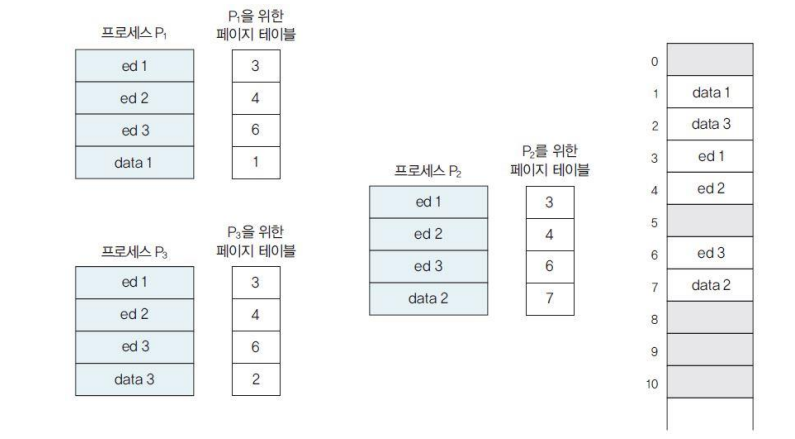

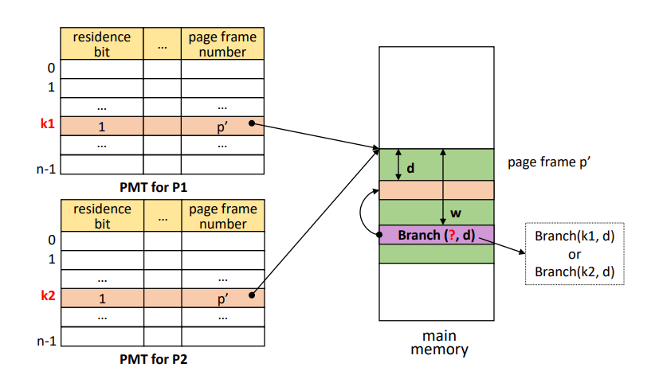

- Procedure Page Sharing
  - 위처럼 같은 위치에 기준이 프로세스마다 다를 수 있음
  - k1, k2 구분하지말고 그냥 K로 통일시키기! (k1 == k2 == k)
  - 프로세스들이 Shard page에 대한 정보를 PMT의 같은 entry에 저장하도록 함

### Page Protection

- 여러 프로세스가 page를 공유할 때,
  - `Protection bit` 사용
  - 해당 위치에서 할 수 있는 일을 제한해둠

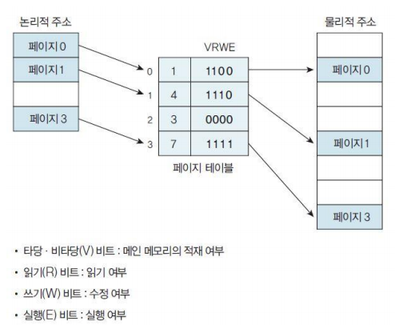

## 4. Segmentation System

- 프로그램을 `논리적` block으로 분할 (segment)
  - Block의 크기가 서로 다를 수 있음
  - stack, heap, main procedure, 등
- 특징
  - 메모리를 미리 분할하지 않음
    - VPM과 유사
  - Segment Sharing/Protection 이 용이함
  - Address Mapping 및 메모리 관리의 Overhead가 큼
  - No internal fragmentation
    - External fragmentation 발생가능

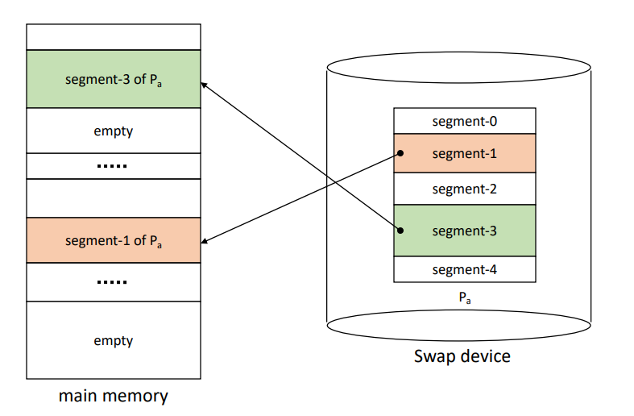

- Address Mapping

  - Virtual address V : (s,d)
    - s : Segment number
    - d : displacement in a segment
  - Segment Map Table(SMT)
    - 권한내용을 SMT 에 포함시킴

  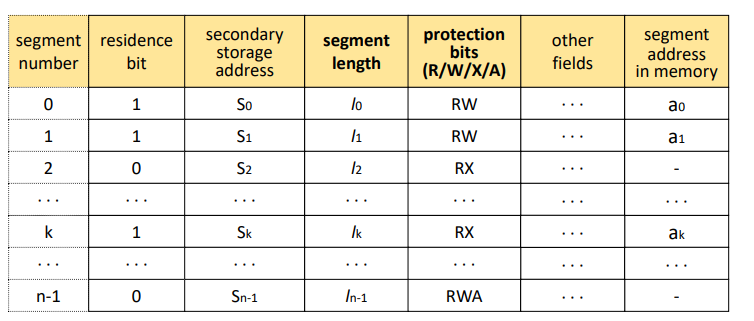

  - Address mapping mechanism
    - Paging system 과 유사

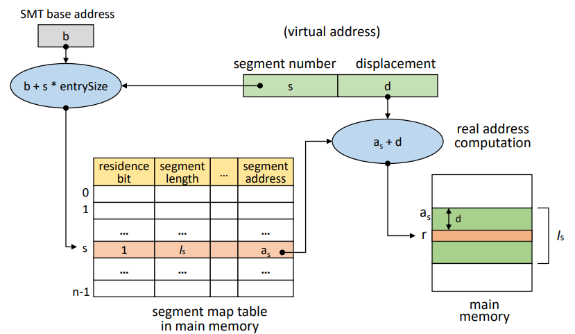

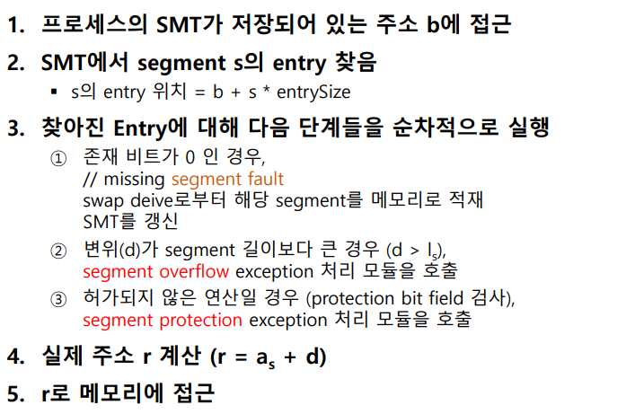

### Paging system - Memory Management

- VPM과 유사
  - Segment 적재 시, 크기에 맞추어 분할 후 적재

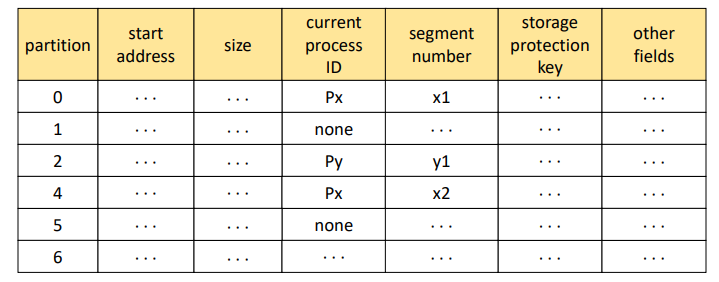

### Segmentation Sharing/Protection

- 논리적으로 분할되어 있어, 공유 및 보호가 용이함

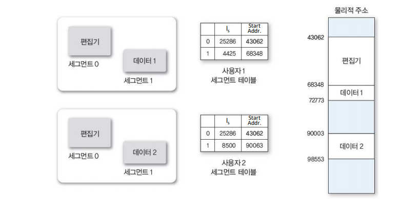

## 5. Hybrid Paging/Segmentaion 

- `Paging`과 `Segmentation`의 장점 결합
  - Page sharing/protection이 쉬움
  - 메모리 할당/관리 overhead가 작음
  - No external fragmentation
- 프로그램 분할
  - 논리 단위의 Segmentaion로 분할
  - 각 segment를 고정된 크기의 page들로 분할
- Page단위로 메모리에 적재
- 단점
  - 전체 테이블 수 증가
    - 메모리 소모가 큼
    - Address mapping 과정이 매우 복잡
  - Direct mapping의 경우, 메모리 접근이 3배
    - 성능 저하 발생

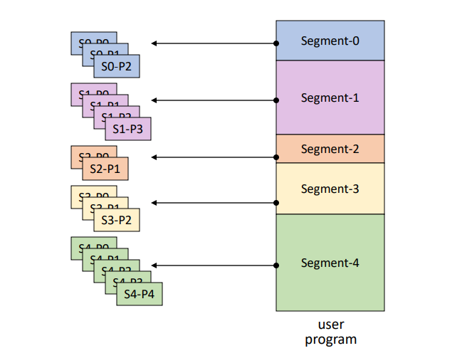

- Address Mapping

  - Virtual address : V = (s, p, d)

    - S : Segment number
    - p : page Number
    - d : offset in a page

  - SMT와 PMT 모두 사용

    - 각 프로세스 마다 하나의 SMT

    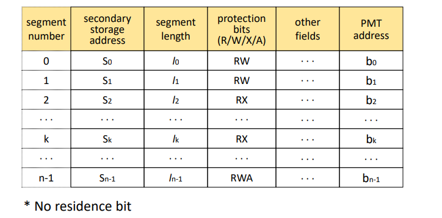

    - 각 segment마다 하나의 PMT

    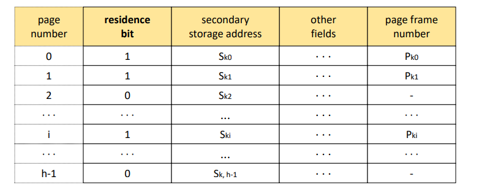

  - Address mapping

    - Direct, associated 등

    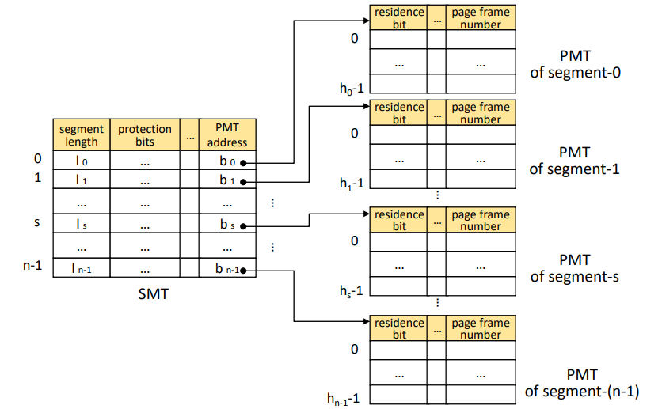

  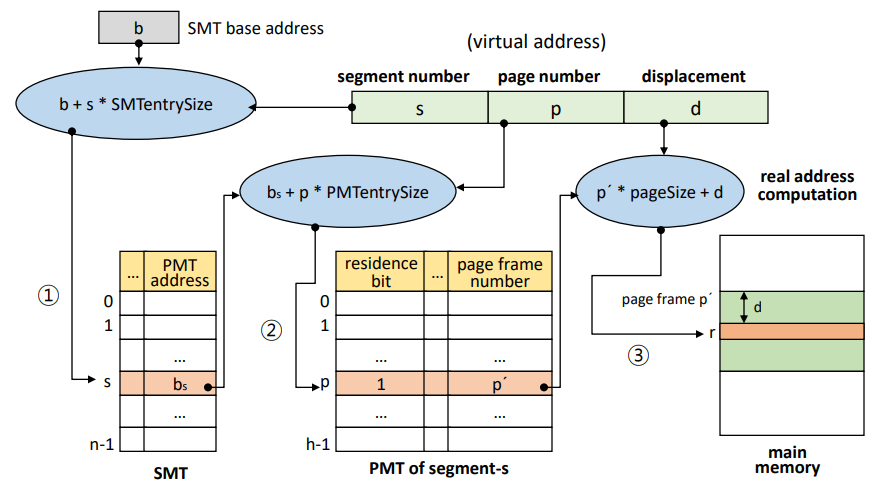

  

  

  - 메모리 관리

    - FPM과 유사

    

###### 	*이  [강의](https://www.youtube.com/playlist?list=PLBrGAFAIyf5rby7QylRc6JxU5lzQ9c4tN)를 통해 공부하고 배운 내용을 정리하였습니다.